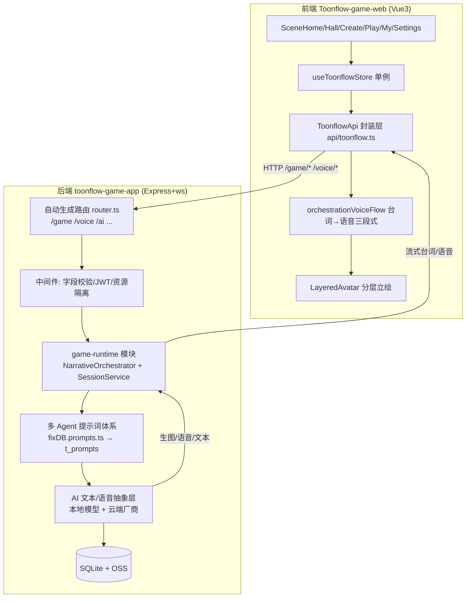
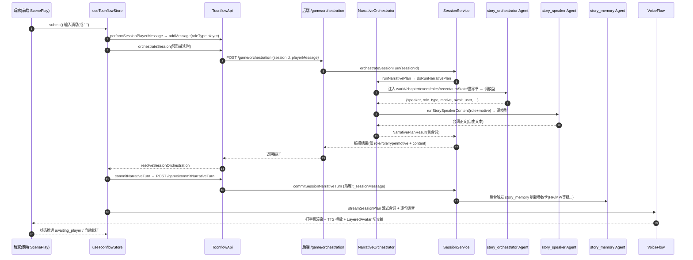

# Toonflow-game 项目总览与运转流程

> 本文档为 Toonflow-game 项目的「地图」。配合 `01_前端业务.md` / `02_后端业务.md` / `03_多Agent系统总述.md` 及 `agents/` 逐 Agent 文档一起阅读。
> 代码来源：`D:\Users\viaco\tools\Toonflow-game\Toonflow-game-web`（前端）、`D:\Users\viaco\tools\Toonflow-game\toonflow-game-app`（后端）。

---

## 1. 项目是什么

Toonflow-game 是一个 **AI 剧情角色扮演游戏引擎**，核心能力是：用大模型驱动「多角色、多章节、带立绘与语音」的互动叙事。它分为两大部分：

- **创作侧（Authoring）**：作者用 Web 界面搭建世界（角色卡、世界书、章节、立绘、语音、剧本/分镜）。
- **运行时侧（Runtime）**：玩家进入故事后，后端用 **多 Agent 编排** 实时生成「谁发言、为什么、说什么、剧情推进到哪」，并驱动前端立绘/语音/数值卡更新。

两大亮点是**本地离线可玩**（本地 Qwen3-0.6B 文本 + MOSS-TTS-Nano 语音 + BiRefNet/MODNet 抠图），云端厂商仅作可选补充。

---

## 2. 技术栈

| 层 | 技术 | 证据 |
|---|---|---|
| 前端 | Vue3 `<script setup>` + Composition API + Vite | `Toonflow-game-web/src/main.ts`、`App.vue` |
| 前端状态 | 单一 `useToonflowStore()` 响应式单例 | `composables/useToonflowStore.ts`(8113 行) |
| 后端 | Express + express-ws（WebSocket） | `toonflow-game-app/src/app.ts:5` 导入 `expressWs` |
| 端口 | 默认 **60002**（环境变量 `PORT` 可覆盖） | `src/app.ts:50` `startServe()` / `src/env.ts` |
| 鉴权 | JWT（`t_setting.tokenKey` 验签） | `src/app.ts:119` `jwt.verify` |
| 数据库 | Knex / SQLite（本地文件） | `src/lib/gameEngine.ts:1569` `getGameDb()` |
| 对象存储 | OSS（立绘/语音/分镜二进制） | `src/routes/game/generateImage.ts:119` 等 `u.oss` 调用 |
| 文本 LLM | `@ai-sdk`（generateText/streamText），OpenAI 兼容协议 | `src/utils/ai/text/index.ts:439` `ai.invoke`/`ai.stream` |
| 本地模型 | Qwen3-0.6B（node-llama-cpp）、MOSS-TTS-Nano、BiRefNet/MODNet | `src/lib/localQwen060.ts` / `localMossTts.ts` / `localAvatarMatting.ts` |

---

## 3. 总体架构

---

## 4. 一轮完整对话的端到端流程（核心）

下面这条链路把前端、后端、多 Agent 串起来，是理解整个项目运转的关键。

### 4.1 关键步骤文字说明

1. **进入游玩**：`store.startFromWorld`（`useToonflowStore.ts:6054`）→ 无会话则 `initStory`+`introduceStory`(开场白流) → `orchestrateSession`(首章) → `streamSessionPlan`。
2. **用户发言**：`submit()` → `performSessionPlayerMessage`（`:7127`）：`addMessage(roleType:"player", orchestrate:false)` → `continueSessionNarrative`（`:7662`，最多 3 轮）。
3. **后端编排入口**：`POST /game/orchestration`（`routes/game/orchestration/index.ts:962`）。有 `sessionId` 走 `orchestrateSessionTurn`（`SessionService.ts:3804`），否则走调试态分支。
4. **编排引擎**：`orchestrateSessionTurnInner`（`:3825`）加载 session/world/state/近期消息 → 同步章节进度 → 推进世界时钟 → `runNarrativePlan`（`NarrativeOrchestrator.ts:4754`）。
5. **编排师决策**：`doRunNarrativePlan`（`:4822`）先走**规则分支** `resolveRuleNarrativePlan`，未命中才调 `storyOrchestratorModel` 决定 who/motive/awaitUser（**只输出结构化编排，不写台词**）。
6. **发言器生成台词**：`runStorySpeakerContent`（`:4358`）按编排结果调 `storySpeakerModel` 生成真正展示的台词（自由文本）。
7. **落库**：`POST /game/commitNarrativeTurn` → `commitSessionNarrativeTurn`（`SessionService.ts:4732`）落库消息、推进回合状态、刷新参数卡。
8. **前端流式呈现**：`streamSessionPlan`（`:7201`）消费 `/game/streamlines` 流（逐字打字机 → 分句 → done 回填）；`orchestrationVoiceFlow` 对每条消息逐句 TTS 播放；`LayeredAvatar` 按角色切前景/背景立绘。
9. **续排/预取**：流结束阶段 `prefetchNextSessionOrchestration` 后台预取下一轮编排，减少 2–4s 延迟。

---

## 5. 目录与文件地图

### 5.1 前端（`Toonflow-game-web/src`）
| 路径 | 职责 |
|---|---|
| `App.vue` | 根组件，按 `activeTab` 切换页面，play 模式隐藏 BottomNav |
| `api/toonflow.ts` | 唯一后端请求封装 `ToonflowApi`（含流式 fetch） |
| `types/toonflow.ts` | 全部数据模型：Story / StoryRole / WorldBookEntry / Chapter / Message / Session |
| `composables/useToonflowStore.ts` | 全局状态 + 所有业务编排动作（8113 行核心） |
| `composables/useWebpAvatar.ts` | WebP 动画立绘首帧定格/播放/循环 |
| `composables/orchestrationVoiceFlow/` | 运行时「编排→台词流→语音」三段式流水线 |
| `components/Scene*.vue` | 页面：Home/Hall/Create/Play/My/Settings/History |
| `components/LayeredAvatar.vue` | 分层立绘（foregroundPath/backgroundPath + WebP 动画） |
| `components/WorldBook*.vue` | 世界书编辑/只读查看 |
| `components/VoiceBindingDialog.vue` | 音色绑定（text/clone/mix/prompt_voice） |
| `components/SettingsModelManagerDialog.vue` | 模型配置管理 + 本地模型安装 |

### 5.2 后端（`toonflow-game-app/src`）
| 路径 | 职责 |
|---|---|
| `app.ts` | 入口：Express+ws、JWT、启动后台服务 |
| `core.ts` / `router.ts` | 路由自动生成（fast-glob 扫 `routes/**`，md5 缓存） |
| `middleware/resourceIsolation.ts` | 资源隔离（projectId/worldId/sessionId 三层） |
| `lib/gameEngine.ts` | **运行时状态模型/归一化库**（非对话引擎） |
| `lib/fixDB.ts` | 全量幂等数据库迁移+种子（导入 fixDB.prompts.ts） |
| `lib/fixDB.prompts.ts` | **剧情多 Agent 提示词权威源**（→ 写 `t_prompts`） |
| `lib/roleParameterCard.ts` | 角色参数卡（hp/mp/exp/level…）AI 生成+归一化 |
| `lib/localQwen060.ts` | 本地 Qwen3-0.6B 文本模型 |
| `lib/localMossTts.ts` / `aliyunCosyVoice.ts` | 本地/云端语音合成 |
| `lib/localAvatarMatting.ts` | 本地人像抠图（BiRefNet/MODNet → 透明前景 PNG） |
| `modules/game-runtime/engines/NarrativeOrchestrator.ts` | **真正的对话生成引擎**（编排+台词） |
| `modules/game-runtime/services/SessionService.ts` | **会话回合流转与落库** |
| `modules/game-runtime/agents/` | 运行时子 Agent（intent/taskMode/orchestrateOptions/playTip/storyUpdateAlign/miniGame） |
| `agents/outlineScript/` / `agents/storyboard/` | 创作侧多 Agent（故事线/大纲/分镜图像） |
| `routes/game/` / `routes/voice/` / `routes/ai/` | REST 接口实现 |
| `utils/ai/text/index.ts` | 文本 LLM 统一抽象层 |

---

## 6. 文档导航

- `01_前端业务.md` —— 前端页面/组件/API/状态/立绘与语音链路
- `02_后端业务.md` —— 后端引擎/路由/DB/参数卡/生图/语音
- `03_多Agent系统总述.md` —— 18 个 Agent 总表、模型键、调用链、输出解析套路
- `agents/agent_story_orchestrator.md` —— 剧情编排师（含 compact/advanced 变体）
- `agents/agent_story_speaker.md` —— 角色发言器
- `agents/agent_story_memory.md` —— 记忆管理器（参数卡）
- `agents/agent_story_chapter.md` —— 章节判定器
- `agents/agent_story_event_progress.md` —— 事件进度检测器
- `agents/agent_mini_game.md` —— 小游戏动作解析（8 子类型）+ 物品出售
- `agents/agent_task_mode.md` —— 任务模式 4-Agent 流水线（intent/progress/director/speaker/completion）
- `agents/agent_play_tip.md` —— 玩家行动建议器
- `agents/agent_orchestrate_options.md` —— 编排选项生成器（剧情/任务两版）
- `agents/agent_story_update_align.md` —— 存档智能对齐
- `agents/agent_legacy.md` —— 未启用项（story_main / story_safety）
