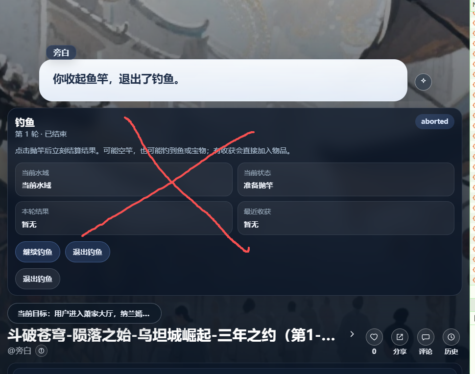

# no_modify
## [fail] 都不要展开这个小游戏面板

[小游戏设计.md](../小游戏设计.md)
[战斗.md](../战斗.md)

设计上是完全通过聊天框来交互的而不是通过这个“小游戏面板” 小游戏面板更多是展示游戏状态，需要默认折叠起来

## [fail] 小游戏的聊天流程
[小游戏设计.md](../小游戏设计.md)
[战斗.md](../战斗.md)

## [fail]  主动退出小游戏
用户输入“#退出” 就应该强制退出小游戏。

## [fail] #小游戏 的台词过于复杂
改为
“（输入 #狼人杀 / #钓鱼 / #修炼 / #研发技能 / #炼药 / #挖矿 / #升级装备 进入小游戏。
游戏中 #退出 可以强制退出小游戏）请输入 # + 小游戏名称 如 #钓鱼”
