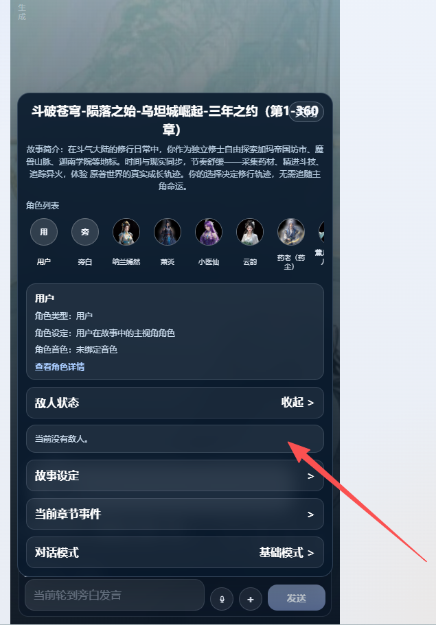
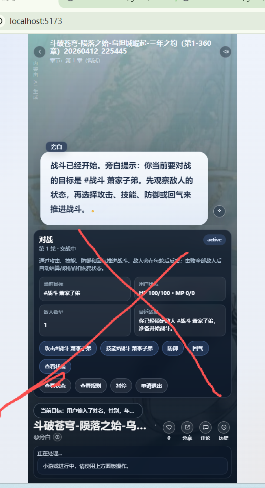

# 战斗小游戏
`##战斗 xxx 如
#战斗 角色名，#战斗 野怪 , #战斗 暴风狼`
进入战斗。

敌人状态。可以查看敌人的头像，名称，级别，血量，蓝量

输入#战斗后。 不能使用这样的面板

直接通过文字输入进行战斗。编排师编排发言者。
例如
`#战斗 萧家子弟
后端设置为战斗模式，创建敌人对象和状态
旁白：装备好与萧家子弟(lv1) 进行战斗了吗？
用户：施展灭魔步攻击。
攻击力等于等级+技能等级+20；
旁白：你施展了灭魔步对对方造成了30点攻击，对方剩余血量70;
某男子:(扮演萧家子弟)，烈焰掌
旁白：萧家子弟对你造成22点攻击，剩余血量78;建议使用补血丹lv1。
用户：吃下补血丹，灭魔尺和灭魔步
回血量：补血丹等级+20
旁白：你施展了灭魔步对对方造成了42点攻击，对方剩余血量28;你的血量为99,消耗了一颗补血丹lv1
某男子:(扮演萧家子弟)，看我的，天龙拳。
。。。。
旁白：萧家子弟血量为0，恭喜你战胜了萧家子弟(lv1)，奖励金钱10，一颗补血丹lv1`