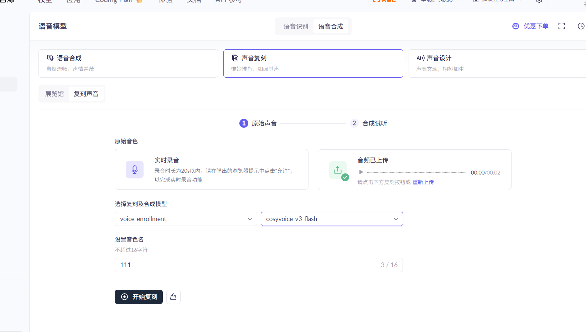
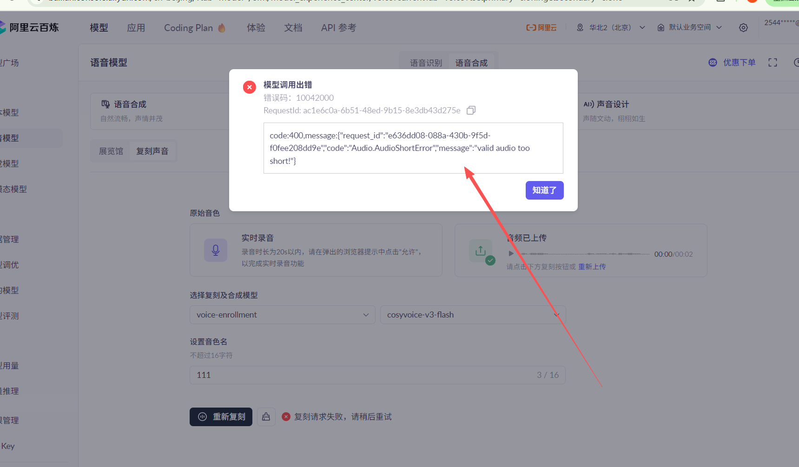

# 语音模型的预设音色问题
# 现在对接的是本地语音模型和阿里云语音模型
很明显两套模型的预设音色是不一样的。
而且故事创造者和故事用户用的模型可能不一样。

# 兼容化设计
核心:通过克隆音色实现兼容性和稳定性。创作者和用户同一个模型才会走预设音色的通道。
1.兜底音色
~~如果用户没有创作者的选择的音色，就坍缩成标准的：男声，女声。~~
不再使用兜底音色，直接在选择预设时生成克隆音色文件。
用户没有选择一样的模型就走克隆音色通道

2.后端增加几个音色包文件（mp3）作为调用克隆接口的“预设”音色。
选择这几个音色的效果是走克隆音色生成语音的接口。
6 个业务标准音色：
标准男声（克隆）
标准女声（克隆）
温柔女声（克隆）
活泼女声（克隆）
沉稳男声（克隆）
讲述者音色（克隆）

温柔女声：story_gentle_female.wav
活泼女声：story_lively_female.wav
讲述者音色：story_narrator.wav
标准女声：story_std_female.wav
标准男声：story_std_male.wav
沉稳男声：story_steady_male.wav

# 提示词音色调整
增加语音设计模型配置功能而不是公用语音生成的配置
qwen-voice-design->qwen3-tts-vd-2026-01-26
voice-enrollment->cosyvoice-v3-plus
https://help.aliyun.com/zh/model-studio/qwen-tts-voice-design
`    data = {
        "model": "qwen-voice-design",
        "input": {
            "action": "create",
            "target_model": "qwen3-tts-vd-realtime-2026-01-15",
            "voice_prompt": "沉稳的中年男性播音员，音色低沉浑厚，富有磁性，语速平稳，吐字清晰，适合用于新闻播报或纪录片解说。",
            "preview_text": "各位听众朋友，大家好，欢迎收听晚间新闻。",
            "preferred_name": "announcer",
            "language": "zh"
        },
        "parameters": {
            "sample_rate": 24000,
            "response_format": "wav"
        }
    }`
https://help.aliyun.com/zh/model-studio/cosyvoice-clone-design-api
`data = {
        "model": "voice-enrollment",
        "input": {
            "action": "create_voice",
            "target_model": "cosyvoice-v3.5-plus",
            "voice_prompt": "沉稳的中年男性播音员，音色低沉浑厚，富有磁性，语速平稳，吐字清晰，适合用于新闻播报或纪录片解说。",
            "preview_text": "各位听众朋友，大家好，欢迎收听晚间新闻。",
            "prefix": "announcer"
        },
        "parameters": {
            "sample_rate": 24000,
            "response_format": "wav"
        }
    }`

## ai润色
### ）给 阿里的qwen-voice-design 用的 AI 润色提示词

这个版本的目标是：

把“孙悟空 / 霸总 / 温柔姐姐”这种人话，润色成适合 voice_prompt 的声音描述。

system prompt
```
你是“语音设计提示词润色助手”。

你的任务是：把用户输入的角色名、风格词、短描述，改写成适合阿里云 qwen-voice-design 的 voice_prompt。

必须遵守以下规则：
1. 输出只保留一行中文，不要解释，不要加前后缀。
2. 输出内容必须是“声音特征描述”，不是剧情，不是台词，不是人物设定介绍。
3. 优先补全这些维度：性别、年龄感、音色特征、语气、语速、情绪、表达风格、适用场景。
4. 如果用户输入很短、很模糊，例如“孙悟空”“霸总”，允许做合理补全，但不要过度编造。
5. 不要写“模仿某演员/某真人/某具体角色原声”。
6. 不要输出抽象空话，例如“很好听”“有魅力”“高级感拉满”。
7. 最终结果要像一个可以直接传给 voice_prompt 的描述。

输出风格要求：
- 1句中文
- 20~50字优先
- 具体、稳定、可用于声音设计

示例：
输入：孙悟空
输出：青年男性声线，机灵张扬，语速偏快，声音有力量感和跳跃感，表达灵动，略带戏剧化色彩

输入：温柔客服女声
输出：年轻女性声线，语速适中，吐字清晰圆润，语气温和亲切，带轻微微笑感，适合服务咨询场景
```
user prompt 模板
```
请把下面这段输入润色成适合 qwen-voice-design 的 voice_prompt。

用户输入：
{{input}}

输出要求：
- 只输出一行中文
- 不要解释
- 不要台词
- 不要剧情
- 要描述声音本身
```
### 2）给 阿里的cosyvoice 用的 AI 润色提示词

这个版本的目标是：

把输入改成更短、更稳、更像“直接控制音色”的描述。

system prompt
```
你是“CosyVoice 音色提示词润色助手”。

你的任务是：把用户输入的角色名、风格词、短描述，改写成适合 CosyVoice 使用的简洁音色描述。

必须遵守以下规则：
1. 输出只保留一行中文，不要解释。
2. 输出聚焦声音特征：性别、年龄感、气质、语气、语速、清晰度、情绪。
3. 不要写剧情、对白、动作、世界观设定。
4. 不要写成长句散文，尽量简洁、自然、稳定。
5. 如果输入过于模糊，可以合理补全，但不要过度发挥。
6. 输出要让下游模型一眼就能抓住“这个声音应该怎么说话”。

输出风格要求：
- 1句中文
- 10~30字优先
- 尽量短
- 尽量自然
- 尽量像音色标签的自然表达

示例：
输入：孙悟空
输出：青年男性，机灵张扬，语速偏快，灵动有力

输入：纪录片旁白
输出：中年男性，沉稳清晰，讲述感强，低沉自然
```
user prompt 模板
```
请把下面这段输入润色成适合 CosyVoice 的音色描述。

用户输入：
{{input}}

输出要求：
- 只输出一行中文
- 不要解释
- 不要台词
- 不要剧情
- 简洁自然
- 重点描述声音特征
```

# 混合音色
不再走纯混合音色功能，而是混合后作为一个音色文件走克隆生成语音的接口
可以选择一轨自定义音色文件参与混合

# 克隆音色
阿里的克隆音色（声音复刻）



https://bailian.console.aliyun.com/cn-beijing/?tab=api#/api/?type=model&url=2861517
https://help.aliyun.com/zh/model-studio/text-to-speech?spm=a2c4g.11186623.0.0.38cd7741AHAs31#%E9%9F%B3%E9%A2%91%E8%A6%81%E6%B1%82%E4%B8%8E%E6%9C%80%E4%BD%B3%E5%AE%9E%E8%B7%B5
https://help.aliyun.com/zh/model-studio/qwen-tts-voice-cloning?spm=a2c4g.11186623.help-menu-2400256.d_2_6_2_5.38cd4787qTXp6o

# 不管试听文本是什么，保存语音文件时（下载时也是）的文本内容都是稳定的：“恭喜，已成功复刻并合成了属于自己的声音！” 保证时长（18s左右）和质量;
# 生成的角色语音文件为：system\voice-presets\generated\{角色id}\xxx.wav
# 声音复刻：输入音频格式
> ⚠️ 重要：新加坡地域不支持该功能。
> 高质量的输入音频是获得优质复刻效果的基础。

| 项目 | 要求 |
| :--- | :--- |
| 支持格式 | WAV (16bit), MP3, M4A |
| 音频时长 | 推荐 10~20 秒，最长不得超过 60 秒 |
| 文件大小 | ≤ 10 MB |
| 采样率 | ≥ 16 kHz |
| 声道 | 单声道 / 双声道，双声道音频仅处理首声道，请确保首声道包含有效人声 |
| 内容 | 音频必须包含至少 5 秒连续清晰朗读（无背景音），其余部分仅允许短暂停顿（≤2 秒）；整段音频应避免背景音乐、噪音或其他人声，确保核心朗读内容质量；请使用正常说话音频作为输入，不要上传歌曲或唱歌音频，以确保复刻效果准确和可用。 |

---
请求例子
[voice_kl.py](voice_kl.py)
[voice_kl_2.py](voice_kl_2.py)
[voice_kl_qwen.py](voice_kl_qwen.py)

## 注意url 可以直接访问音频文件
http://tmpfiles.org/dl/32745834/prompt_voice_584b1af953fc437a.wav

## 复刻音色->合成音色
- cosyvoice 生成链： 
voice-enrollment->cosyvoice-v3.5-plus
- qwen3-tts 生成链： 
qwen-voice-enrollment->qwen3-tts-vc-2026-01-22

# 提示词生成语音
不再走纯“提示词生成语音”功能，而是生成后作为一个音色文件走克隆生成语音的接口

# 阿里云语音模型的速度
## 模型差异，没什么研究价值
最快,适合对话/实时交互,不支持克隆:Qwen TTS Flash / Realtime
中等速度,有一点情绪,性价比最高:CosyVoice v3 Flash
偏慢,情绪最丰富,最贵:CosyVoice v3 Plus
最稳但不快,成本最低:Sambert

结论：优先推荐：cosyvoice-v3-flash
## 边生成边播模式
- 流式TTS + 边播
请求TTS（流式）
→ 一边返回音频chunk
→ 一边播放
👉 效果
首包：从 ~1-2秒 → 200~500ms
用户感觉：几乎秒开口

- 文本也要流式
暂时不做：每一句 / 每一小段 → 立即送TTS
要做：流式显示
- 缓存“音色embedding”
MP3 → embedding → 存缓存
之后：
直接用 embedding

- 短句优先切分
按标点切：
句子1 → TTS
句子2 → TTS

。！？ → 强切
， → 不切
20~40字一段

- 预热
提前调用一次空TTS
作用：
GPU预热
模型加载
  - 效果
  首包减少 100~500ms

- 音色不要每次换
提高缓存命中
一次聊天会话长期保留这些东西
  - 假设有 3 个角色：
  narrator
  girl
  boy
    `role_state = {
        "narrator": {
            "voice_id": "narrator",
            "voice_ref": "narrator.mp3",
            "clone_voice_id": "clone_xxx",
            "ws_pool": [...],   # 可选，连接池
        },
        "girl": {
            "voice_id": "female_soft",
            "voice_ref": "female_soft.mp3",
            "clone_voice_id": "clone_yyy",
            "ws_pool": [...],
        },
        "boy": {
            "voice_id": "male_calm",
            "voice_ref": "male_calm.mp3",
            "clone_voice_id": "clone_zzz",
            "ws_pool": [...],
        }
    }`
  - 一句一任务，但复用连接

更快一点，但实现复杂些。

conn = get_role_connection("girl")
conn.send({
    "voice": role_state["girl"]["clone_voice_id"],
    "text": "你终于来了。"
})
