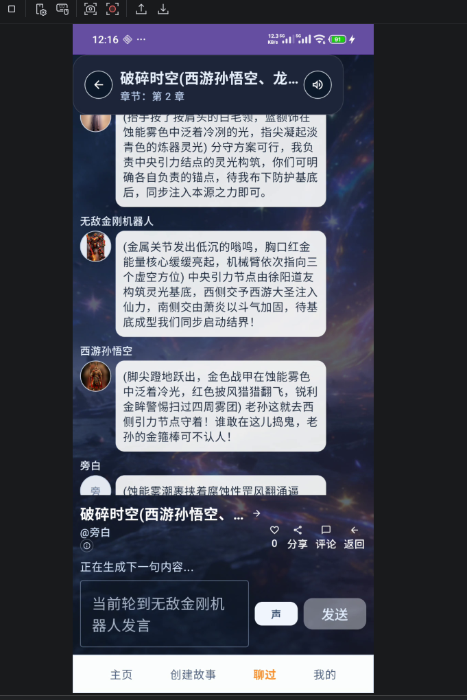

# 剧情发展与章节目标问题
编排师工作有点脱离章节内容和章节目标了而且要么就用户一直说，要么一直没得说。
分析一下为什会这样，如何可以依然高效编排但是剧情可控，旁白如何引导剧情发展到章节目标。

章节内容例子：
```
## 全局状态（仅用户可见）
@系统：
你已被卷入【混沌裂隙】

你当前身份：时空干扰者（临时）

你具备能力：
- 感知异常（隐藏目标 / 能量波动）
- 短暂干扰（1次/章节）
- 标记目标（用于后续追踪）

⚠️ 注意：你无法改变既定大事件，但可以影响过程与结果细节

---

## 场景开始

@旁白：
破碎的星辰残骸漂浮在虚空之中，有些仍在燃烧，有些已经冷却成死寂的岩石。

七彩的时空光带在裂隙周围扭曲缠绕，仿佛某种不可名状的力量正在撕裂现实的边界。

低沉的空间嗡鸣声从四面八方传来。

远处——雷鸣般的轰响隐隐回荡。

---

@旁白：
突然，一道金光撕裂虚空。

一根巨大的铁棒从天而降，轰然插入混沌晶石之中。

“轰——！”

---

@西游孙悟空：
"此处虚空——俺老孙镇着。"

---

@旁白：
蓝白色闪光骤然亮起。

另一道身影出现。

黑发、橙衣、金色气焰。

---

@龙珠悟空：
"嘿！你很强啊！"

---

@旁白：
两人同时出手！

拳与棍碰撞——

虚空震裂！

---

## 🧩 用户行动1（被编排触发）

@系统（仅对用户）：
你被冲击波掀飞，落在一块漂浮碎石上。

你脚下的【混沌晶石】正在震动。

你察觉到异常——  
那根金箍棒，似乎在回应你。

👉 请发言你的行动（自然语言）

你可以：
- 观察（金箍棒 / 战斗 / 周围）
- 接触晶石
- 接近战场
- 提醒某人

---

## 主线推进

@旁白：
战斗愈发激烈。

棍影与拳影交织。

空间不断崩裂。

---

@旁白：
裂隙再次撕开——

这一次，是火焰。

---

@萧炎：
"看来我来得正是时候。"

---

@旁白：
佛怒火莲缓缓旋转。

三股力量——彻底碰撞！

---

## 🧩 用户行动2（异常感知）

@系统（仅对用户）：
⚠️ 检测到异常

在所有人注意力集中在战斗中心时——

你发现：

战场边缘，有一道极淡的气息  
正在靠近金箍棒。

其他人没有察觉。

👉 请发言你的行动：

你可以：
- 提醒某人
- 锁定该气息
- 静观其变
- 收集能量或碎片

---

## 高潮：时间停滞

@旁白：
爆炸达到顶点——

然后——

一切，静止。

---

@旁白：
火焰凝固。

金光停滞。

时间——停止流动。

---

## 🧩 用户行动3（唯一干预机会）

@系统（仅对用户）：
⚠️ 你是唯一仍可行动的人

你看见——

一道青衫身影，正走向金箍棒。

他不受时间影响。

👉 你只有一次行动机会

请直接输入你的行为（自然语言）

例如：
- 我冲上去阻止他
- 我标记他
- 我记住他的样子
- 我干扰空间

---

## 结局触发（根据用户行为生成差异反馈）

@旁白：
下一瞬——

时间恢复！

---

@旁白：
轰！！！

能量彻底爆发！

---

@旁白：
而那根金箍棒——

消失了。

---

@西游孙悟空：
"……谁？！"

---

@龙珠悟空：
"刚才……不对劲！"

---

@萧炎：
"呵，有人比我们更快。"

---

@徐阳（远处，低声）：
"好宝贝……归我了。"

---

## 🎯 章节结算（系统生成）

@系统：

第2章结束：混沌交锋

固定结果：
✔ 如意金箍棒被夺

你的影响（根据行为生成）：

- 若你标记目标 → 你获得【徐阳追踪标记】
- 若你尝试阻拦 → 你受伤，并被徐阳注意
- 若你记录信息 → 你获得【徐阳身份信息】
- 若你未行动 → 你未能介入关键事件

👉 下一章将基于你的行为展开
```

成功条件（章节结局）
```
徐阳偷走如意金箍棒
```

实际运行效果，完全在放飞 ，用户完全没有交互，完全脱离章节和结束条件。



- 原因分析1:过度依靠最近的聊天记录（20）作为依规比重过大导致忽略
章节内容，动态故事背景，成功条件。
是agent 提示词设计不合理还是别的原因

- 原因分析2：章节内容篇幅过长，章节精炼文本的提取缺乏重点。
[模型配置设计.md](../../模型配置设计/模型配置设计.md)
里的的编排师功能专项化.已经有精炼话的要求。首先有没有实现。然后是实现的效果好不好。
里的记忆管理师。产生的动态参数是否真的比较好的帮助作用。
章节精炼化后是否把细节全砍没了。
