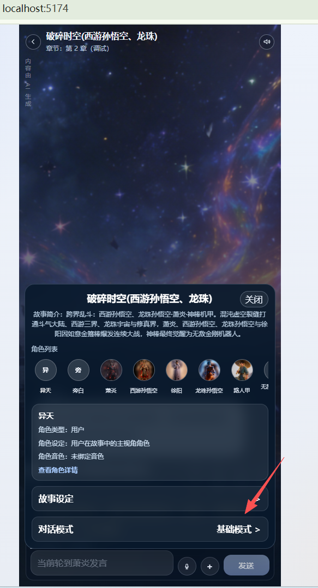

# no_modify
# bug 的解决方案
1.编排师机制重新要回来:
编排流程(`/game/orchestration`)
编排->下一个角色获取新台词->
返回台词-》编排ing+播放语音ing -》两样事情结束-》编排->下一个角色获取新台词
完全删除phase（阶段）机制！！！！
改为编排师轻量化设计：
发送的内容砍为：
对话内容砍为10个台词+当前事件内容+事件序号+ 各个角色简洁的文字化动态参数卡
大模型返回:下个角色，角色动机，事件内容是否需要调整，调整结果。是否需要触发记忆管理

2.章节内容事件化
发布故事时把每个章节转为事件数据进行持久化
故事的静态数据
{
故事id,
章节id.
事件序号,
事件内容
}

对话的动态数据
{
故事id,
章节id.
对话id,
事件序号,
事件内容
}

故事事件在对话时转换为动态事件。

对话事件进度
{
故事id,
对话id,
当前章节id.
当前事件序号.
}
编排师会根据大模型返回的内容动态调整对话的当前事件内容。

2.续聊 
马上走一次
返回最新台词-》编排ing+播放语音ing -》两样事情结束-》编排->下一个角色获取新台词

3.记忆管理师轻量化
30秒扫一次,只发新台词，需要记录上次发送的台词序号。有新台词才访问大模型。
编排师也能触发记忆管理,但是触发发现没有新台词依然不访问大模型。
新台词+动态参数记忆（动态故事背景+动态角色文字化参数卡）

ai:
“30 秒扫一次”那句，我保留的是更合理的“消息增量 + 事件增量触发”，不是定时轮询。

# 前端可观事件列表和进度

故事设定下面增加一个当前章节的事件，点击展开当前章节事件列表和事件进度
展示当前事件的前五后四个事件也就是最多10个。

# 章节调试的事件生成方案
为当前章节生成静态事件。其他章节不管，动态事件数据只存在内存
结束条件成功，生成下个章节的静态事件。继续调试。
就算没有事件编排师也应该在编排时生成一个。而且结束条件本身就是个特殊事件！！