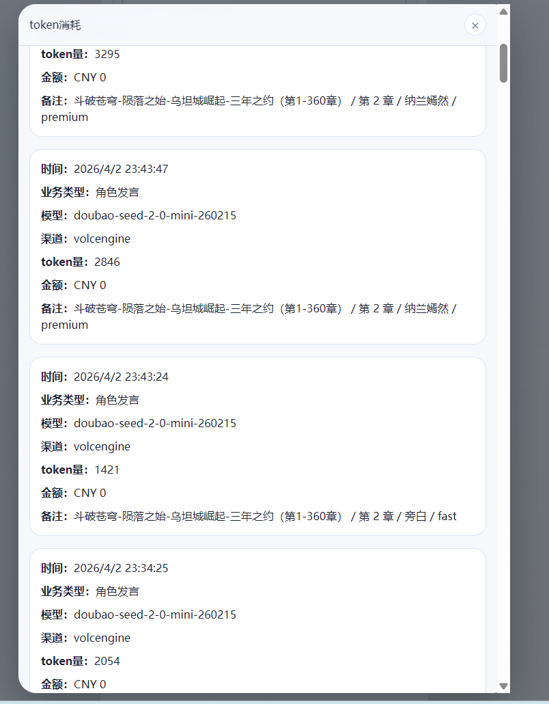

# no_modify
# 编排师等agent_3.0 简直是灾难
1.本来ai认为：很多轮次本来不需要模型决定“谁说”
结果：改成了编排师不作为，编排机制全废。无编排。灾难性！
2.ai:phase（阶段） 已经强约束为 `某男子 -> 萧炎 -> 旁白`
这是什么意思？
不知道什么意思，但是以前是
编排流程(`/game/orchestration`)
编排->下一个角色获取新台词->
返回台词-》编排ing+播放语音ing -》两样事情结束-》编排->下一个角色获取新台词

而现在估计是使用硬编码编排，导致了编排短路，甚至角色识别错误。

3.看日志发现编排师和记忆管理师已经完全罢工
只留下了角色发言。灾难性！！！

4.ai:规则优先，不必每轮都问模型
结果编排机制完全崩溃

5.ai:记忆更新从“每轮刷新”改成“按事件刷新”
什么意思？靠什么来判断是否更新？硬编码还是ai 分析？

# 回答放在
[ai故事_编排师等agent_3.0_bug_Answer.md](ai%E6%95%85%E4%BA%8B_%E7%BC%96%E6%8E%92%E5%B8%88%E7%AD%89agent_3.0_bug_Answer.md)