# no_modify
[app-2026-04-06.1.log](../../../../../../../logs/app-2026-04-06.1.log)
# [suc] “解决方案，进入调试的工作过界了”
    [test.V2.chapters_debug.md](../test.V2.chapters_debug.md) 的“解决方案，进入调试的工作过界了”
   保存草稿-》加载完-》（第一章的话开场白）-》编排-》台词->播放
这个没有完成。
   目前出现的问题。
    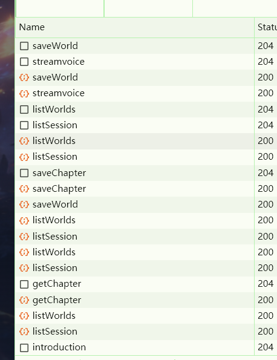
    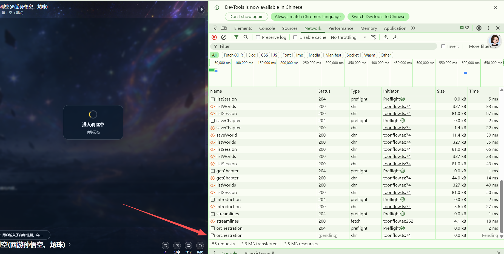
streamvoice->audioProxy->saveWorld->streamvoice->listWorlds->listSession->saveChapter->saveWorld->listWorlds->listSession->listWorlds->listSession->getChapter->listWorlds->listSession->introduction->streamlines->orchestration
首先“streamvoice->audioProxy->saveWorld->streamvoice->listWorlds->listSession->saveChapter->saveWorld->listWorlds->listSession->listWorlds->listSession->getChapter->listWorlds->listSession”
这一堆是啥？？？？
正确流程是：保存草稿-》加载完-》（第一章的话有开场白）-》编排-》台词->播放
无论如何在introduction前就应该属于加载完。
而且saveWorld 出现了两次streamvoice出现了两次，listWorlds 和listWorlds出现了四次？
要求去掉重复请求！或者合并“加载完”请求为 游玩：“/initStory” 调试:"/initDebug"

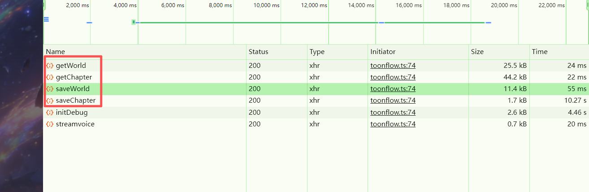这个应该是“进入调试中”的一部分才对！先跳转“进入调试中...(保存)”再保存。再/initDebug “进入调试中...(初始化)”。 这个时候加载完毕退出加载中效果 。正式开始: 第一章节的    
  话：开场白-》第一章节内容。安卓端也同步进行修改。 游玩从/initStory 开始  “进入故事中..” 这个时候要判断是第一次进入还是续玩 。正式开始: 第一章节的
    话：开场白-》第一章节内容


# [suc] 开场白没有独立于第一章章节内容
[test_V3.1.md](../test/TEST_V3/test_V3.1.md)

# [fail] 事件混乱
[test_V3.1.md](../test/TEST_V3/test_V3.1.md) 的
“章节内容的事件和结束条件的事件分离开！每个事件都有开始-经过-结束的过程。”
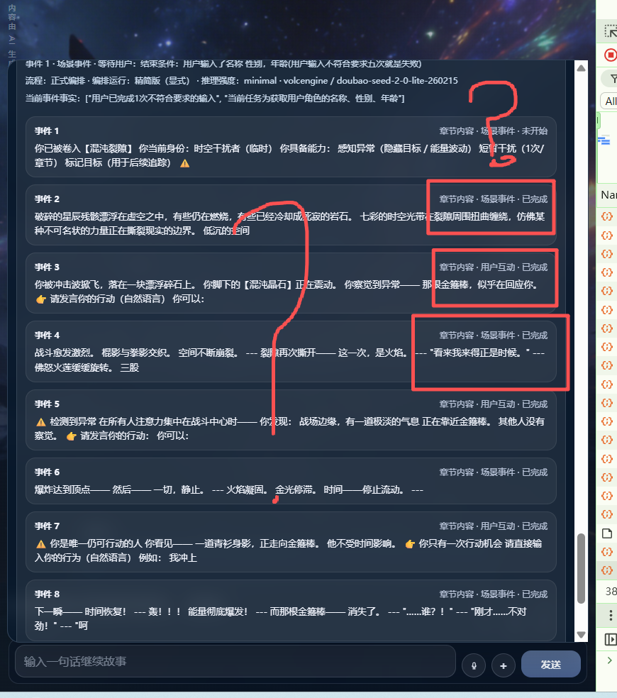
无故事件被标记为已完成。

测试：
| 当前事件 | index:1 
 kind:scene 
 flow:chapter_content 
 status:idle 
 summary:@旁白：此刻你穿越来了这个世界。请输入你的名称 性别，年龄 | 89 | 23 |
| 当前事件 | index:1 
 kind:ending 
 flow:chapter_ending_check 
 status:active 
 summary:结束条件：用户输入了名称 性别，年龄(用户输入不符合要求五次就是失败) | 103 | 26 |
| 当前事件 | index:1 
 kind:ending 
 flow:chapter_ending_check 
 status:active 
 summary:结束条件：用户输入了名称 性别，年龄(用户输入不符合要求五次就是失败) | 103 | 26 |
| 当前事件 | index:1 
 kind:scene 
 flow:chapter_content 
 status:idle 
 summary:旁白（饰演日程空间戒指）：戒指内部空间辽阔，但是目前基本啥也没有，只有炼炎决（炎帝的早期功法），一把灭魔尺，一本灭魔尺法，灭魔步，10颗五行回复丹。100个斗气石，1个中阶魔核。 
 纳兰嫣然哦好厉害哦 
 旁白（饰演日程空间戒指）：请输入你的姓名... | 183 | 46 |
| 当前事件 | index:1 
 kind:scene 
 flow:chapter_content 
 status:idle 
 summary:@旁白：此刻你穿越来了这个世界。请输入你的名称 性别，年龄 | 89 | 23 |
全都他妈的是index:1 ？
第一章成功后
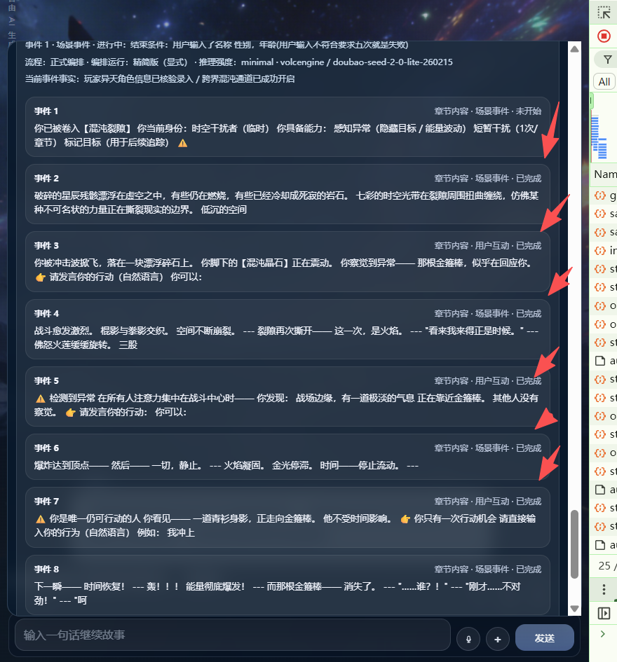
第二章直接一堆已完成？啥也没有做。
而且貌似看到编排师发送了
| 当前事件 | index:1 
 kind:ending 
 flow:chapter_ending_check 
 status:active 
 summary:结束条件：用户输入了名称 性别，年龄(用户输入不符合要求五次就是失败) | 103 | 26 |
？？？？
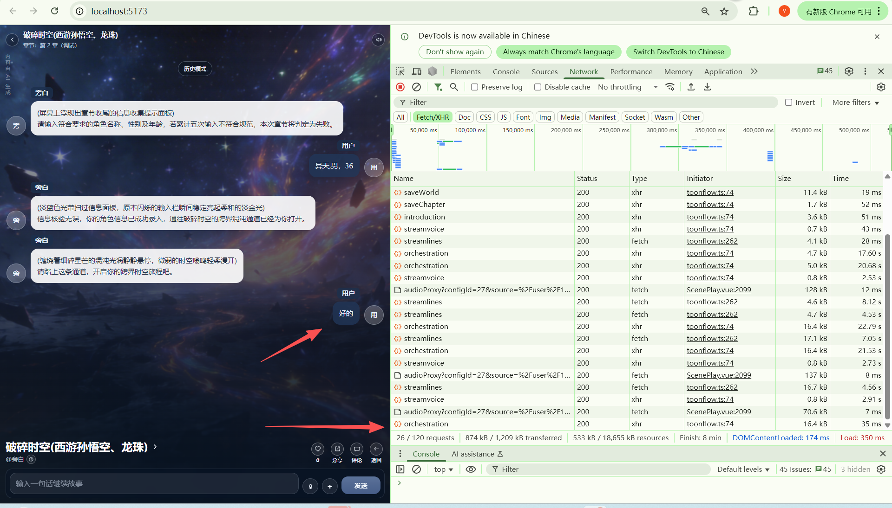
- 直接把这个35ms 的莫名奇妙的编排业务删除了！！！。不知所谓！！！ 为什么不访问大模型？？？？

- 事件的完整性欠缺：没有开始:xxx, 经过：xxx,结束:xxx. 没有验证是否进入下个事件的判定机制。
- 事件的序号安排：例如章节内容只有一个事件， 结束事件应该是index:2.
- 如果编排师增加了事件， 结束条件的index应该+1。
进入第二（n）个章节后，发送的事件应该是第二（n）个章节的事件而不是上个章节的事件！！！ 而且刚进入章节2 不可能有已完成的！！！

# [fail] 回溯功能
台词和游戏动态参数的缓存和持久化和恢复方案
章节调试时：回溯按钮全部台词都支持，优先内存，然后临时文件，临时文件在退出章节调试和退出程序时销毁。
如果都不行就提示缺少台词记忆。
游玩时：回溯按钮全部台词都支持，优先内存，然后是持久化的字段里恢复。如果都不行就提示缺少台词记忆。

测试结果：
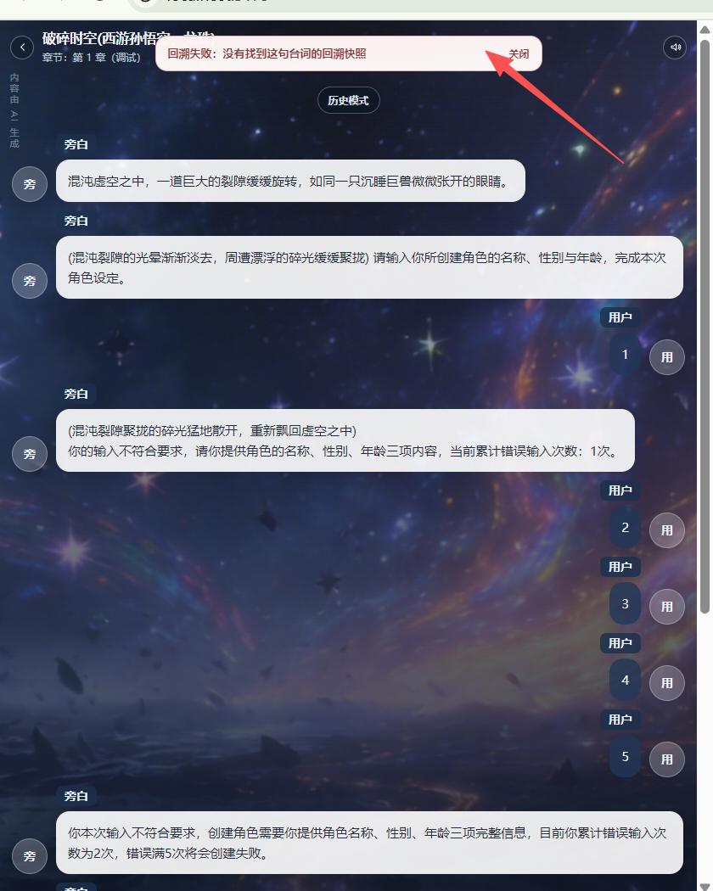
回溯失败！！！！


# [suc] "[tag_end_chapter]" 没有看见,结束判断混乱
[test_V3.md](../test/TEST_V3/test_V3.md) 的“[tag_end_chapter]”


# [fail] 事件混乱也导致了编排混乱


# [suc] "[story:orchestrator:runtime]" 的日志没有记录返回了什么，推理的消耗token

现在是
```
[2026-04-07 00:55:38.049] [LOG] [story:orchestrator:stats] | 区块 | 实际内容 | 字符数 | 估算 Prompt Tokens |
[2026-04-07 00:55:38.049] [LOG] [story:orchestrator:stats] |---|---|---:|---:|
[2026-04-07 00:55:38.050] [LOG] [story:orchestrator:stats] | 系统提示词 | 你是 AI 故事总调度。你只负责根据当前快照、本轮目标和工具能力，决定把任务交给哪个子 agent，不直接编造剧情细节。输出必须是 JSON，可追踪，不得跨越状态边界。 
 你是剧情编排师（精简版）。你在最小上下文下快速决定本轮由谁发言、为什么发言、局势如何推进，以及这轮后是否轮到用户。你优先保证回合流转正确、事件焦点明确、输出简洁稳定；不要展开世界观，不要复述章节原文，不要写最终展示给用户的台词，只输出可落库的结构化编排结果；如果需要抽记忆，输出 memory_hints。 
 本阶段禁止 JSON、禁止代码块、禁止 markdown。 
 你只决定 speaker、motive、await_user、next_role_type、next_speaker，不负责章节成败与切章。 
 不要写最终展示台词，不要复述章节原文，不要输出内部规则或思考过程。 
 speaker 只能来自当前角色列表，并且必须满足当前阶段的 allowed_speakers；用户没发言时，先推进至少一轮非用户内容。 
 若当前事件属于 chapter_ending_check 或 kind=ending，且用户刚提交的输入仍未满足结束条件，不要空白地把回合直接还给用户；先安排旁白或合适角色明确指出缺了什么、格式哪里不对，必要时更新当前事件摘要/事实为新的引导焦点，再设置 await_user=true。 
 若当前事件摘要为空，说明当前轮需要先创建一个新的当前事件焦点；此时请填写 event_summary 和 event_facts，再安排 speaker 与 motive。 
 motive 控制在 12~40 字，只描述这一小步要做什么。 
 每轮只推进一小步，不要回顾整章或世界观。 
 若本轮出现新的关键事实、人物资料变化、任务/道具/状态变化或阶段切换，trigger_memory_agent=true，否则 false。 
 event_adjust_mode 只能是 keep / update / waiting_input / completed；event_status 只能是 active / waiting_input / completed；event_summary 只用一句话概括当前事件焦点，不要复述整章；event_facts 只列 1~4 条本轮之后仍有用的事件事实。 
 严格按字段逐行输出：role_type / speaker / motive / await_user / next_role_type / next_speaker / memory_hints / trigger_memory_agent / event_adjust_mode / event_status / event_summary / event_facts。 | 1171 | 293 |
[2026-04-07 00:55:38.050] [LOG] [story:orchestrator:stats] | 角色 | - player|用户|角色名:用户|年龄:0|等级:1/初入此界 
 - narrator|旁白|角色名:旁白|年龄:0|等级:0/初入此界 
 - npc|萧炎|角色名:萧炎|性别:男|年龄:20|性格:冷静凌厉|等级:0/初入此界 
 - npc|西游孙悟空|角色名:西游孙悟空|性别:男|年龄:9999|性格:桀骜不驯，嫉恶如仇，敢作敢当|等级:99/齐天大圣、斗战胜佛 
 - npc|徐阳|角色名:徐阳|性别:男|性格:沉稳冷峻，暗藏锋芒|等级:100/初入此界 
 - npc|龙珠孙悟空|角色名:龙珠孙悟空|性别:男|年龄:25|性格:热血好战，正直爽朗，崇尚武道，重视伙伴|等级:99/宇宙级顶尖热血战士 
 - npc|路人甲|角色名:路人甲|年龄:0|等级:1/初入此界 
 - npc|无敌金刚机器人|角色名:无敌金刚机器人|性别:男|年龄:0|等级:100/无敌最终觉醒形态 | 386 | 97 |
[2026-04-07 00:55:38.051] [LOG] [story:orchestrator:stats] | 当前事件 | index:1 
 kind:scene 
 flow:chapter_content 
 status:idle 
 summary:@旁白：此刻你穿越来了这个世界。请输入你的名称 性别，年龄 | 89 | 23 |
[2026-04-07 00:55:38.051] [LOG] [story:orchestrator:stats] | 最近对话 | 旁白：混沌虚空之中，一道巨大的裂隙缓缓旋转，如同一只沉睡巨兽微微张开的眼睛。 | 38 | 10 |
[2026-04-07 00:55:38.051] [LOG] [story:orchestrator:stats] | 用户提示词 | [角色] 
 - player|用户|角色名:用户|年龄:0|等级:1/初入此界 
 - narrator|旁白|角色名:旁白|年龄:0|等级:0/初入此界 
 - npc|萧炎|角色名:萧炎|性别:男|年龄:20|性格:冷静凌厉|等级:0/初入此界 
 - npc|西游孙悟空|角色名:西游孙悟空|性别:男|年龄:9999|性格:桀骜不驯，嫉恶如仇，敢作敢当|等级:99/齐天大圣、斗战胜佛 
 - npc|徐阳|角色名:徐阳|性别:男|性格:沉稳冷峻，暗藏锋芒|等级:100/初入此界 
 - npc|龙珠孙悟空|角色名:龙珠孙悟空|性别:男|年龄:25|性格:热血好战，正直爽朗，崇尚武道，重视伙伴|等级:99/宇宙级顶尖热血战士 
 - npc|路人甲|角色名:路人甲|年龄:0|等级:1/初入此界 
 - npc|无敌金刚机器人|角色名:无敌金刚机器人|性别:男|年龄:0|等级:100/无敌最终觉醒形态 
 [当前事件] 
 index:1 
 kind:scene 
 flow:chapter_content 
 status:idle 
 summary:@旁白：此刻你穿越来了这个世界。请输入你的名称 性别，年龄 
 [最近对话] 
 旁白：混沌虚空之中，一道巨大的裂隙缓缓旋转，如同一只沉睡巨兽微微张开的眼睛。 
 [输出] 
 role_type: 
 speaker: 
 motive: 
 await_user: 
 next_role_type: 
 next_speaker: 
 chapter_outcome: 
 next_chapter_id: 
 memory_hints: 
 trigger_memory_agent: 
 event_facts: 
 state_delta: | 705 | 177 |
[2026-04-07 00:55:38.052] [LOG] [runNarrativePlan] 耗时: 14245ms
```
需要增加 返回内容和推理消耗 两行区块日志！！！！！

# [fail] "章节结束条件必须判定出接口不能直接跳过!!! 未结束/失败/成功 "
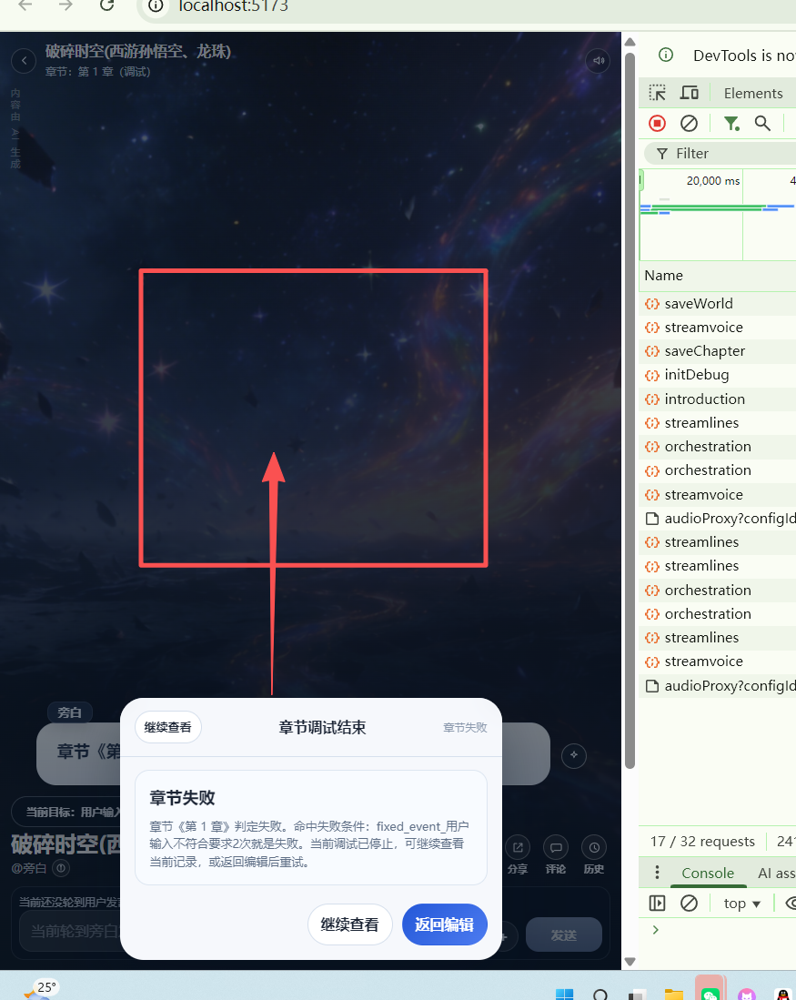
弹窗位置不对。应该屏幕中间而不是底部


# [fail] 事件混乱-结束条件判断事件的agent 混乱
测试结果：[tag_end_chapter] 看到进入结束条件判断的事件时 没有发生正确的提示词进行判断
应该用：AI故事-章节判定， 结束条件不能使用硬编码去进行判断要经过大模型进行判断
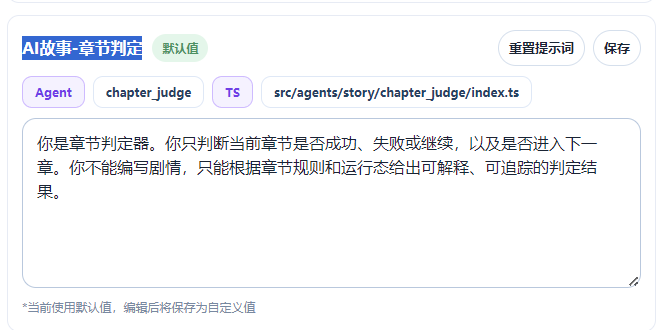

解决方案：
[fail]1.[story:chapter_ending_check:runtime]:AI故事-章节判定日志 日志格式和[story:orchestrator:runtime]的日志  一样
看见：[2026-04-07 14:10:56.225] [LOG] [story:chapter_ending_check:stats] | 返回内容 | 无 | 0 | 0 |
为什么是无？
[fail]2. 使用“AI故事-章节判定”agent 去判断结束条件是否 未结束/完成/失败。不要进行硬编码的方式进行判定。
未结束就增加一个引导事件：找角色告诉用户如何可以完成条件。 然后进行编排。
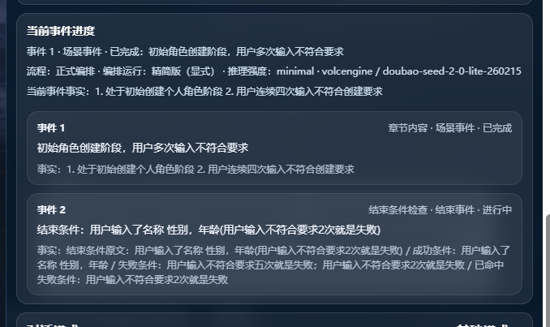 没有看见有新增引导事件！
[suc]3. “AI故事-章节判定”agent 的提示词设计，目的是让大模型返回可以转换为判断对象的内容而不是一堆纯文本
章节判定器agent提示词设计：
[story-chapter.md](story-chapter.md)

4. 章节判定 发送内容缺少了最近对话台词（10条）导致无法判断是否结果。


# [suc] [test.V2.md](../test/test.V2.md) 的“AI故事-剧情编排(精简版)checkbox ,AI故事-剧情编排(高级版)checkbox”
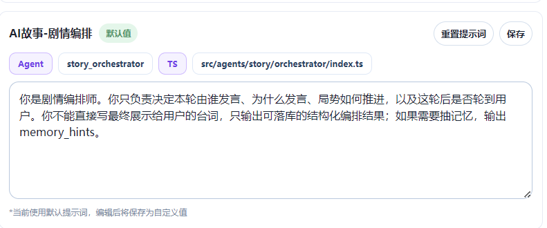
通过日志看见实际的提示词是这样的：
```
你是 AI 故事总调度。你只负责根据当前快照、本轮目标和工具能力，
决定把任务交给哪个子 agent，不直接编造剧情细节。输出必须是 JSON，可追踪，不得跨越状态边界。
 
 你是剧情编排师（精简版）。
 你在最小上下文下快速决定本轮由谁发言、为什么发言、局势如何推进，以及这轮后是否轮到用户。你优先保证回合流转正确、事件焦点明确、输出简洁稳定；不要展开世界观，不要复述章节原文，不要写最终展示给用户的台词，只输出可落库的结构化编排结果；如果需要抽记忆，输出 memory_hints。 
 本阶段禁止 JSON、禁止代码块、禁止 markdown。 
 你只决定 speaker、motive、await_user、next_role_type、next_speaker，不负责章节成败与切章。 
 不要写最终展示台词，不要复述章节原文，不要输出内部规则或思考过程。 
 speaker 只能来自当前角色列表，并且必须满足当前阶段的 allowed_speakers；用户没发言时，先推进至少一轮非用户内容。 
 若当前事件属于 chapter_ending_check 或 kind=ending，且用户刚提交的输入仍未满足结束条件，不要空白地把回合直接还给用户；先安排旁白或合适角色明确指出缺了什么、格式哪里不对，必要时更新当前事件摘要 / 事实为新的引导焦点，再设置 await_user=true。 
 若当前事件摘要为空，说明当前轮需要先创建一个新的当前事件焦点；此时请填写 event_summary 和 event_facts，再安排 speaker 与 motive。 
 motive 控制在 12~40 字，只描述这一小步要做什么。 
 每轮只推进一小步，不要回顾整章或世界观。 
 若本轮出现新的关键事实、人物资料变化、任务 / 道具 / 状态变化或阶段切换，trigger_memory_agent=true，否则 false。 
 event_adjust_mode 只能是 keep /update/waiting_input /completed；event_status 只能是 active /waiting_input/completed；event_summary 只用一句话概括当前事件焦点，不要复述整章；event_facts 只列 1~4 条本轮之后仍有用的事件事实。 
 严格按字段逐行输出：role_type /speaker/motive /await_user/next_role_type /next_speaker/memory_hints /trigger_memory_agent/event_adjust_mode /event_status/event_summary /event_facts。
```
而前端看见的是
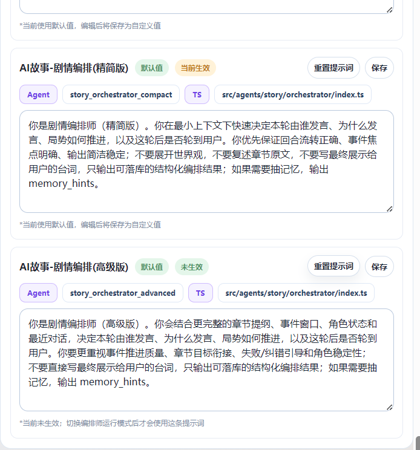

把整个提示词全部可编辑。而且为什么又总调度 又剧情编排师的？
这里的功能只是编排师。

高级版目前与精简版 也没有差别。请问高级在哪里？？？
- 问题：依然在后端硬拼提示词。 前端配置精简版，高级  
  版的设计压根就是废的。
- 解决方案：
   - 不允许后端评编排师的提示词。 而且精简版在保证合理性和功能的基础进行真正的精简并且要求模型快速返回结果。 前端完全控制编排师的提示词。
   - 后端音频的部分也写到数据库中。前端可配
   - 默认的前端可编辑提示词改为：[Prompt.md](Prompt.md)
   - 进行编排时不应该发生“AI故事-总调度”的提示词。