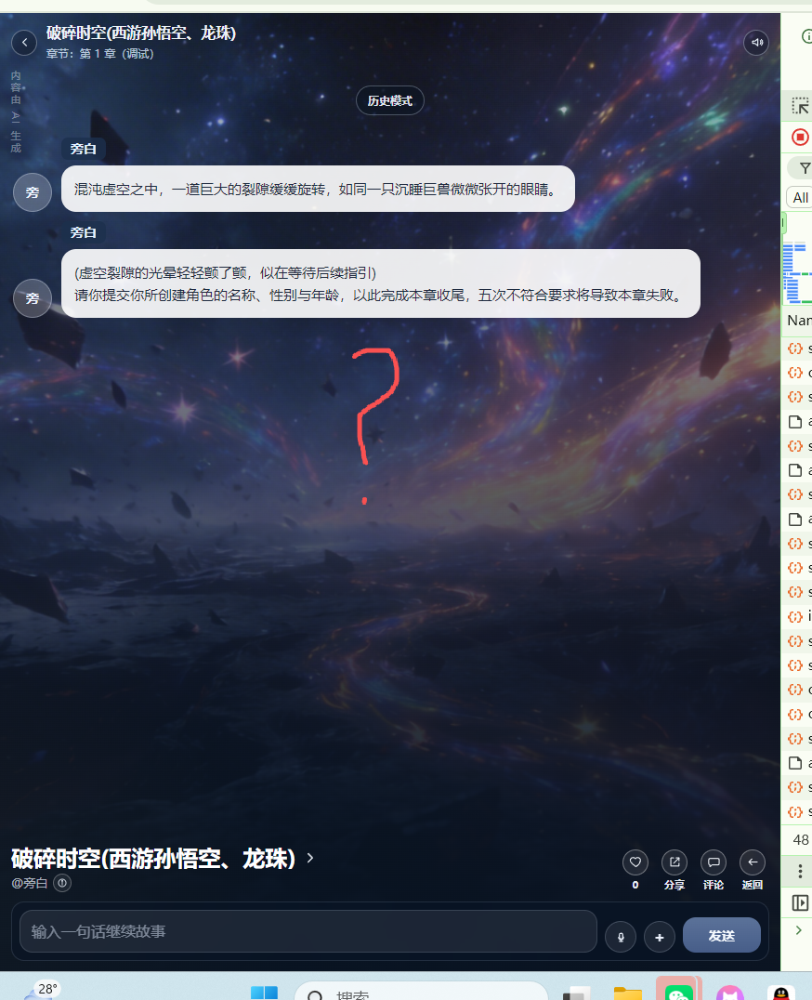

# no_modify
[app-2026-04-06.1.log](../../../../../../../logs/app-2026-04-06.1.log)
# [suc] “解决方案，进入调试的工作过界了”
    [test.V2.chapters_debug.md](../test.V2.chapters_debug.md) 的“解决方案，进入调试的工作过界了”
   保存草稿-》加载完-》（第一章的话开场白）-》编排-》台词->播放
这个没有完成。
   目前出现的问题。
    
    
streamvoice->audioProxy->saveWorld->streamvoice->listWorlds->listSession->saveChapter->saveWorld->listWorlds->listSession->listWorlds->listSession->getChapter->listWorlds->listSession->introduction->streamlines->orchestration
首先“streamvoice->audioProxy->saveWorld->streamvoice->listWorlds->listSession->saveChapter->saveWorld->listWorlds->listSession->listWorlds->listSession->getChapter->listWorlds->listSession”
这一堆是啥？？？？
正确流程是：保存草稿-》加载完-》（第一章的话有开场白）-》编排-》台词->播放
无论如何在introduction前就应该属于加载完。
而且saveWorld 出现了两次streamvoice出现了两次，listWorlds 和listWorlds出现了四次？
要求去掉重复请求！或者合并“加载完”请求为 游玩：“/initStory” 调试:"/initDebug"
# [suc] 开场白没有独立于第一章章节内容
[test_V3.1.md](../test/TEST_V3/test_V3.1.md)

# [fail] 事件混乱
[test_V3.1.md](../test/TEST_V3/test_V3.1.md) 的
“章节内容的事件和结束条件的事件分离开！每个事件都有开始-经过-结束的过程。”

无故事件被标记为已完成。

测试：
| 当前事件 | index:1 ↩ kind:scene ↩ flow:chapter_content ↩ status:idle ↩ summary:@旁白：此刻你穿越来了这个世界。请输入你的名称 性别，年龄 | 89 | 23 |
| 当前事件 | index:1 ↩ kind:ending ↩ flow:chapter_ending_check ↩ status:active ↩ summary:结束条件：用户输入了名称 性别，年龄(用户输入不符合要求五次就是失败) | 103 | 26 |
| 当前事件 | index:1 ↩ kind:ending ↩ flow:chapter_ending_check ↩ status:active ↩ summary:结束条件：用户输入了名称 性别，年龄(用户输入不符合要求五次就是失败) | 103 | 26 |
| 当前事件 | index:1 ↩ kind:scene ↩ flow:chapter_content ↩ status:idle ↩ summary:旁白（饰演日程空间戒指）：戒指内部空间辽阔，但是目前基本啥也没有，只有炼炎决（炎帝的早期功法），一把灭魔尺，一本灭魔尺法，灭魔步，10颗五行回复丹。100个斗气石，1个中阶魔核。 ↩ 纳兰嫣然哦好厉害哦 ↩ 旁白（饰演日程空间戒指）：请输入你的姓名... | 183 | 46 |
| 当前事件 | index:1 ↩ kind:scene ↩ flow:chapter_content ↩ status:idle ↩ summary:@旁白：此刻你穿越来了这个世界。请输入你的名称 性别，年龄 | 89 | 23 |
全都他妈的是index:1 ？
第一章成功后

第二章直接一堆已完成？啥也没有做。
而且貌似看到编排师发送了
| 当前事件 | index:1 ↩ kind:ending ↩ flow:chapter_ending_check ↩ status:active ↩ summary:结束条件：用户输入了名称 性别，年龄(用户输入不符合要求五次就是失败) | 103 | 26 |
？？？？

直接把这个35ms 的莫名奇妙的编排业务删除了！！！。不知所谓！！！

事件的完整性欠缺：没有开始:xxx, 经过：xxx,结束:xxx. 没有验证是否进入下个事件的判定机制。
事件的序号安排：例如章节内容只有一个事件， 结束事件应该是index:2.
如果编排师增加了事件， 结束条件的index应该+1。
进入第二（n）个章节后，发送的事件应该是第二（n）个章节的事件而不是上个章节的事件！！！

# [fail] 回溯功能
台词和游戏动态参数的缓存和持久化和恢复方案
章节调试时：回溯按钮全部台词都支持，优先内存，然后临时文件，临时文件在退出章节调试和退出程序时销毁。
如果都不行就提示缺少台词记忆。
游玩时：回溯按钮全部台词都支持，优先内存，然后是持久化的字段里恢复。如果都不行就提示缺少台词记忆。

测试结果：

回溯失败！！！！

# [fail] "[tag_end_chapter]" 没有看见,结束判断混乱
[test_V3.md](../test/TEST_V3/test_V3.md) 的“[tag_end_chapter]”

测试结果：
全都是："why":"章节结束条件未命中" 。没有出现判定失败的情况
成功的倒是有：,"why":"命中运行时事件规则:fixed_event_用户输入了名称_性别_年龄"

# [fail] 事件混乱也导致了编排混乱

# [fail] "[story:orchestrator:runtime]" 的日志没有记录返回了什么，推理的消耗token

# [fail] "章节结束条件必须判定出接口不能直接跳过!!! 未结束/失败/成功 "
没有弹框提示结束条件判定失败。只有禁止输入。交互拉胯
第二次进行章节调试：被直接判定为了失败？非常离谱

# [suc] [test.V2.md](../test/test.V2.md) 的“AI故事-剧情编排(精简版)checkbox ,AI故事-剧情编排(高级版)checkbox”

现在没有办法看到和修改高级版 的提示词内容。
暂时当作通过。其实依然有问题。没看出高级版高级在哪里。