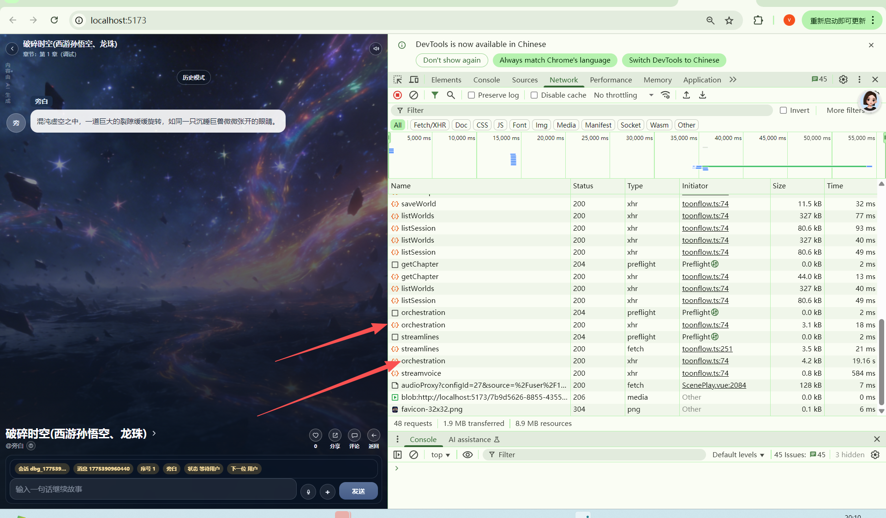
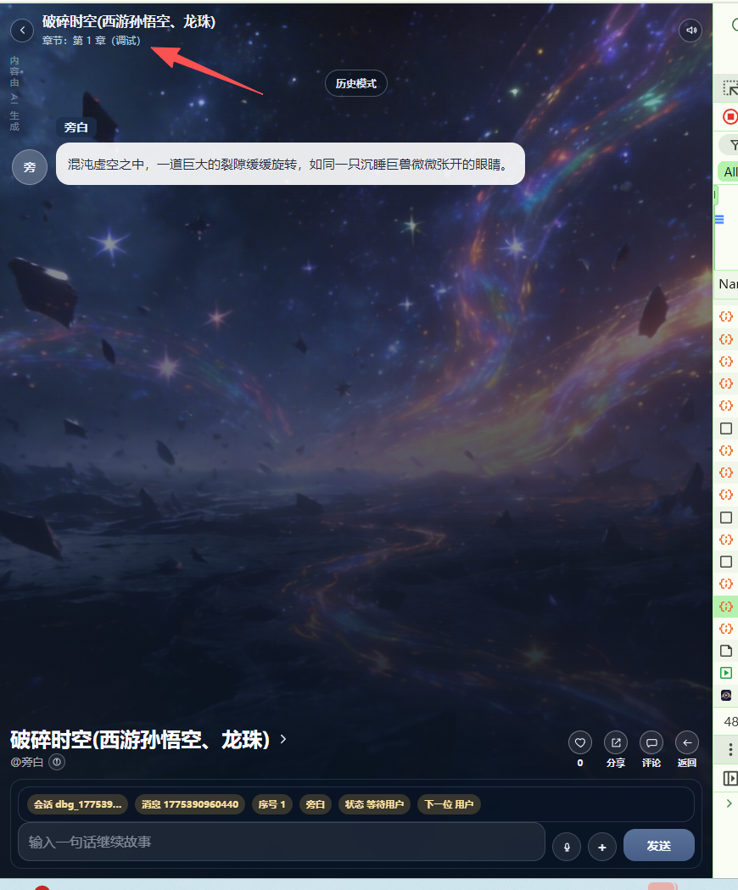
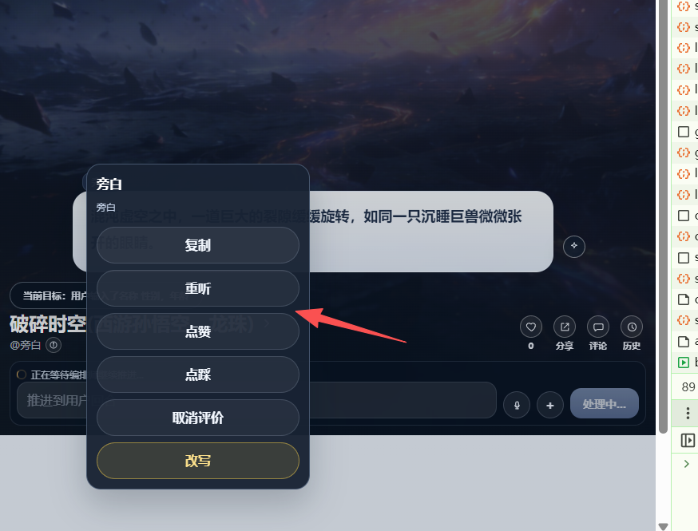

# 开场白设计。
播放开场白后进入第一章。首先开场白的编排是特殊的编排
讲完正式进入第一章。

# 而现状是：

[app-2026-04-05.2.log](app-2026-04-05.2.log)

开场白后直接进入用户发言环境。

而且可以看见发送了两次：orchestrator
第一次是18ms，第二次是19s .
所以第一次是在干嘛呢？

编排师的事件内容发送了什么“：
 index:1 ↩ kind:scene ↩ summary:@旁白：此刻你穿越来了这个世界。请输入你的名称 性别，年龄
 index:1 ↩ kind:ending ↩ summary:结束条件：用户输入了名称 性别，年龄 
 index:1 ↩ kind:scene ↩ summary:@旁白：此刻你穿越来了这个世界。请输入你的名称 性别，年龄
 index:1 ↩ kind:scene ↩ summary:@旁白：此刻你穿越来了这个世界。请输入你的名称 性别，年龄 

# 问题分析
问题分析
## 现象
开场白播放后直接进入用户发言环境（而不是进入第一章编排）
发送了两次 orchestrator：第一次 18ms（几乎瞬间），第二次 19s（正常编排）
根因分析
根据 debugStep.ts 的代码逻辑，问题出在以下流程：

// 第 185-203 行：开场白分支（无 messages）
if (!messages.length) {
  // 设置 canPlayerSpeak = false
  setRuntimeTurnState(state, world, { canPlayerSpeak: false, ... });
  return res.status(200).send(success(buildDebugSuccessPayload({
    messages: [asDebugMessage(openingRuntimeMessage)],
  })));
}

// 第 206-216 行：检查 canPlayerSpeak
if (canPlayerSpeakNow(state, world)) {
  return res.status(200).send(success(buildDebugSuccessPayload({
    messages: [],  // ← 直接返回空消息，进入用户发言环境
  })));
}

// 第 218 行开始：编排流程
const orchestrator = await runNarrativeOrchestrator({...});

问题链路
开场白播放：setRuntimeTurnState 设置 canPlayerSpeak = false
第一次请求（18ms）：前端轮询或立即调用 → canPlayerSpeak = false → 进入编排 → 第一次 orchestrator (18ms)
编排结果可能设置了 canPlayerSpeak = true
第二次请求（19s）：canPlayerSpeak = true → 直接返回 → 看起来像进入了用户发言
但由于某种原因又触发了编排 → 第二次 orchestrator (19s)

这编排debug 日志问题：
两次orchestrator 接口何来的四次日志？？？
为什么四个都是index1？
是不是开场白，章节内容，结束条件均使用了序号1 作为事件序号？

# 解决方案
## 加强结束条件判断的严谨性
在 evaluateCondition 中拒绝空字符串条件
// gameEngine.ts 第 1754 行
if (typeof condition === "string") {
  const text = condition.trim();
  if (!text) return false;  // ← 改为返回 false，而不是 true
  // ...
}

在 hasEffectiveRule 中检查空值
`function hasEffectiveRule(input: unknown): boolean {
  if (input === null || input === undefined) return false;
  if (typeof input === "string") return input.trim().length > 0;
  if (Array.isArray(input)) return input.length > 0;
  if (typeof input === "object") {
    const keys = Object.keys(input as Record<string, unknown>);
    if (keys.length === 0) return false;
    // 检查是否所有值都是空的
    const allValuesEmpty = keys.every(key => {
      const value = (input as Record<string, unknown>)[key];
      return value === null || value === undefined || 
             (typeof value === "string" && value.trim() === "") ||
             (Array.isArray(value) && value.length === 0);
    });
    return !allValuesEmpty;
  }
  return true;
}
`
## 明确分离开场白和第一章
### 前端明显的分离

第一章调试，基础加载完成后首先进入的是开场白流程，显示的也是开场白！

### 后端分离
开场白不再使用/orchestrator .而是/Introduction
编排过程删除业务：messages 为空，直接返回开场白。因为开场白和第一章节进行彻底分离

## 事件问题
例子
开场白:xxxx
章节内容
`@旁白：此刻你穿越来了这个世界。请输入你的名称 性别，年龄`
成功条件（章节结局）:
`用户输入了名称 性别，年龄`

- 第一：开场白不作为事件。无需编排直接出 直接根据故事的设置生成台词

- 第二：章节内容的事件和结束条件的事件分离开！每个事件都有开始-经过-结束的过程。
index:1 ↩ kind:scene ↩type:chapter_content summary:@旁白：此刻你穿越来了这个世界。请输入你的名称 性别，年龄
index:2 ↩ kind:ending type:chapter_ending_check summary:结束条件：用户输入了名称 性别，年龄 

- 章节结束条件必须判定出接口不能直接跳过!!! 未结束/失败/成功 
失败要弹窗提示（可关闭），章节失败。提示可以进行回溯。不再进行编排。
双击台词在重听后面增加回溯按钮。对话和事件进度回到这句台词然后继续编排。

台词回溯就简单，因为只是删除掉后面的。
动态参数的回溯呢？
游玩模式：直接在台词持久化时增加一个字段。把这些内容以一种压缩的形式存在回溯（revisitData）字段里。
章节调试：当然是直接存到内存（5个台词）和临时文件中（回溯信息以压缩态存在，临时文件防内存爆）。
