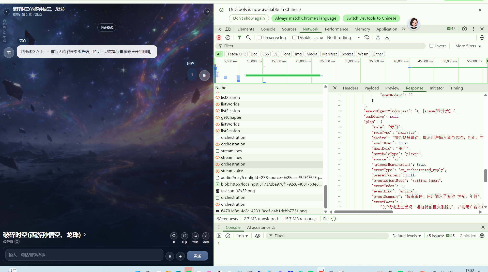

[app-2026-04-05.2.log](app-2026-04-05.2.log)
# 编排耗时分析
首先这次使用的模型是：volcengine:doubao-seed-2-0-lite-260215，推理是"reasoningEffort":"minimal"
速度感觉上比doubao-seed-2-0-mini-260215 快。为什么？
```
[2026-04-05 17:57:10.549] [LOG] [story:orchestrator:runtime] {"modelKey":"storyOrchestratorModel","manufacturer":"volcengine","model":"doubao-seed-2-0-lite-260215","reasoningEffort":"minimal","payloadMode":"compact","payloadModeSource":"explicit"}
[2026-04-05 17:57:10.550] [LOG] [story:orchestrator:stats] request_chars=1632 estimated_tokens=409 system_chars=975 user_chars=657
[2026-04-05 17:57:10.550] [LOG] [story:orchestrator:stats] request_status=success
[2026-04-05 17:57:10.550] [LOG] [story:orchestrator:stats] 以下为 prompt 体积估算，不等于模型真实 usage。
[2026-04-05 17:57:10.551] [LOG] [story:orchestrator:stats] | 区块 | 实际内容 | 字符数 | 估算 Prompt Tokens |
[2026-04-05 17:57:10.551] [LOG] [story:orchestrator:stats] |---|---|---:|---:|
[2026-04-05 17:57:10.551] [LOG] [story:orchestrator:stats] | 系统提示词 | 你是 AI 故事总调度。你只负责根据当前快照、本轮目标和工具能力，决定把任务交给哪个子 agent，不直接编造剧情细节。输出必须是 JSON，可追踪，不得跨越状态边界。 ↩ 你是剧情编排师。你只负责决定本轮由谁发言、为什么发言、局势如何推进，以及这轮后是否轮到用户。你不能直接写最终展示给用户的台词，只输出可落库的结构化编排结果；如果需要抽记忆，输出 memory_hints。 ↩ 本阶段禁止 JSON、禁止代码块、禁止 markdown。 ↩ 你只决定 speaker、motive、await_user、next_role_type、next_speaker，不负责章节成败与切章。 ↩ 不要写最终展示台词，不要复述章节原文，不要输出内部规则或思考过程。 ↩ speaker 只能来自当前角色列表，并且必须满足当前阶段的 allowed_speakers；用户没发言时，先推进至少一轮非用户内容。 ↩ 若当前事件摘要为空，说明当前轮需要先创建一个新的当前事件焦点；此时请填写 event_summary 和 event_facts，再安排 speaker 与 motive。 ↩ motive 控制在 12~40 字，只描述这一小步要做什么。 ↩ 每轮只推进一小步，不要回顾整章或世界观。 ↩ 若本轮出现新的关键事实、人物资料变化、任务/道具/状态变化或阶段切换，trigger_memory_agent=true，否则 false。 ↩ event_adjust_mode 只能是 keep / update / waiting_input / completed；event_status 只能是 active / waiting_input / completed；event_summary 只用一句话概括当前事件焦点，不要复述整章；event_facts 只列 1~4 条本轮之后仍有用的事件事实。 ↩ 严格按字段逐行输出：role_type / speaker / motive / await_user / next_role_type / next_speaker / memory_hints / trigger_memory_agent / event_adjust_mode / event_status / event_summary / event_facts。 | 975 | 244 |
[2026-04-05 17:57:10.552] [LOG] [story:orchestrator:stats] | 角色 | - player|用户|角色名:用户 ↩ - narrator|旁白|角色名:旁白 ↩ - npc|萧炎|角色名:萧炎|性别:男|年龄:25|性格:冷静凌厉，意志坚定|等级:9/斗尊巅峰 ↩ - npc|西游孙悟空|角色名:西游孙悟空|性别:男|年龄:500|性格:桀骜不驯，嫉恶如仇，敢作敢当，重情重义|等级:99/齐天大圣、斗战胜佛，顶级神话强者 ↩ - npc|徐阳|角色名:徐阳|性别:男|年龄:30000|性格:沉稳冷峻，暗藏锋芒|等级:80/高阶炼器修士 ↩ - npc|龙珠孙悟空|角色名:龙珠孙悟空|性别:男|年龄:25|性格:热血单纯，好战善战，善良正直，重视伙伴|等级:90/宇宙顶尖热血武道战士 ↩ - npc|路人甲|角色名:路人甲|年龄:0|等级:1/初入此界 ↩ - npc|无敌金刚机器人|角色名:无敌金刚机器人|年龄:0|等级:99/无敌 | 371 | 93 |
[2026-04-05 17:57:10.552] [LOG] [story:orchestrator:stats] | 当前事件 | index:1 ↩ kind:scene ↩ summary:@旁白：此刻你穿越来了这个世界。请输入你的名称 性别，年龄 | 56 | 14 |
[2026-04-05 17:57:10.552] [LOG] [story:orchestrator:stats] | 最近对话 | 旁白：混沌虚空之中，一道巨大的裂隙缓缓旋转，如同一只沉睡巨兽微微张开的眼睛。 | 38 | 10 |
[2026-04-05 17:57:10.553] [LOG] [story:orchestrator:stats] | 用户提示词 | [角色] ↩ - player|用户|角色名:用户 ↩ - narrator|旁白|角色名:旁白 ↩ - npc|萧炎|角色名:萧炎|性别:男|年龄:25|性格:冷静凌厉，意志坚定|等级:9/斗尊巅峰 ↩ - npc|西游孙悟空|角色名:西游孙悟空|性别:男|年龄:500|性格:桀骜不驯，嫉恶如仇，敢作敢当，重情重义|等级:99/齐天大圣、斗战胜佛，顶级神话强者 ↩ - npc|徐阳|角色名:徐阳|性别:男|年龄:30000|性格:沉稳冷峻，暗藏锋芒|等级:80/高阶炼器修士 ↩ - npc|龙珠孙悟空|角色名:龙珠孙悟空|性别:男|年龄:25|性格:热血单纯，好战善战，善良正直，重视伙伴|等级:90/宇宙顶尖热血武道战士 ↩ - npc|路人甲|角色名:路人甲|年龄:0|等级:1/初入此界 ↩ - npc|无敌金刚机器人|角色名:无敌金刚机器人|年龄:0|等级:99/无敌 ↩ [当前事件] ↩ index:1 ↩ kind:scene ↩ summary:@旁白：此刻你穿越来了这个世界。请输入你的名称 性别，年龄 ↩ [最近对话] ↩ 旁白：混沌虚空之中，一道巨大的裂隙缓缓旋转，如同一只沉睡巨兽微微张开的眼睛。 ↩ [输出] ↩ role_type: ↩ speaker: ↩ motive: ↩ await_user: ↩ next_role_type: ↩ next_speaker: ↩ chapter_outcome: ↩ next_chapter_id: ↩ memory_hints: ↩ trigger_memory_agent: ↩ event_facts: ↩ state_delta: | 657 | 165 |
[2026-04-05 17:57:10.553] [LOG] [runNarrativePlan] 耗时: 13584ms
```


# 开场白-》第一章的流程错误
播放开场白后进入第一章。首先开场白的编排是特殊的编排
讲完正式进入第一章。


而现在的效果是编排完，要用户输入。用户输入1 也能进入章节2

也就是压根没有对章节结束条件进行判断就进入了章节2.
LOG_LEVEL=DEBUG 时 输出统计日志
[日志tag.md](../../../../../../../code/%E6%97%A5%E5%BF%97tag.md)
[tag_end_chapter]:章节结束判断。{章节}{条件}{为什么判断结束}[test.V2.ending.md](../test.V2.ending.md)
检查一下：[test.V2.ending.md](../test.V2.ending.md) 这个问题是是否解决，为什么依然判断失败