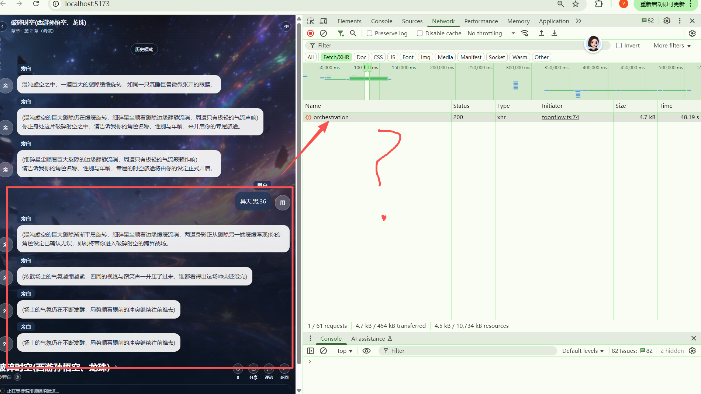

## 为啥 为什么请求只有一个编排然后一直旁白在说话。在干个啥子？？？

## 编排师到底发了什么， 用了49秒？模型

## 编排师返回给大模型的内容

从日志中可以看到，编排师发送给大模型的 **User Prompt** 结构如下：

```
[世界]
名称: (故事名称)
简介: (世界简介)

[章节内部提纲]
标题: (章节标题)
提纲摘录: (章节提纲)
用户交互节点: (用户可以做的选择)
开场白: (章节开场)

[角色列表]
- narrator | 旁白 | 描述...
- player | 异天 | 描述...
- npc | 其他角色 | 描述...

[剧情摘要]
(当前剧情状态)

[当前阶段]
label: (阶段名称)
goal: (阶段目标)
allowed_speakers: (允许发言的角色)

[当前事件]
index: (事件索引)
kind: scene
summary: (事件摘要)
facts: (事件事实)
事件窗口:
(事件窗口内容)

[回合状态]
can_player_speak: true/false
expected_role_type: narrator/player
last_speaker: 旁白/异天

[最近对话]
(最近对话内容)

[用户本轮输入]
(用户输入)

[输出字段]
role_type:
speaker:
motive:
await_user:
next_role_type:
next_speaker:
chapter_outcome:
memory_hints:
event_facts:
```

## 编排师返回的完整 JSON

```
{
  "role_type": "narrator",
  "speaker": "旁白",
  "motive": "向玩家介绍当前战场处境，点明未被察觉的边缘异常气息",
  "await_user": true,                    ← 关键：等待用户发言
  "next_role_type": "player",             ← 关键：下一轮是用户
  "next_speaker": "异天",
  "chapter_outcome": "角色设定完成，成功进入第2章跨界战场",
  "next_chapter_id": "2",
  "memory_hints": "用户异天（男，36）已进入破碎时空跨界战场...",
  "trigger_memory_agent": true,
  "event_adjust_mode": "update",
  "event_status": "active",
  "event_summary": "用户异天进入破碎时空跨界战场，等待用户选择行动",
  "event_facts": [
    "用户角色异天（男，36）已完成设定并进入战场",
    "战场存在破碎星辰残骸，此前多位强者围绕金箍棒大战",
    "战场边缘存在未被其他强者察觉的异常气息"
  ],
  "state_delta": "玩家异天的状态更新为..."
}
```

## 编排师具体发了什么
编排师发送的完整请求
[test.V2.1.detail.md](test.V2.1.detail.md)
System Prompt (编排师角色设定)
你是 AI 故事总调度。你只负责根据当前快照、本轮目标和工具能力，决定把任务交给哪个子 agent，不直接编造剧情细节。输出必须是 JSON，可追踪，不得跨越状态边界。

你是剧情编排师。你只负责决定本轮由谁发言、为什么发言、局势如何推进，以及这轮后是否轮到用户。你不能直接写最终展示给用户的台词，只输出可落库的结构化编排结果；如果需要抽记忆，输出 memory_hints。

本阶段禁止 JSON、禁止代码块、禁止 markdown。
你只决定 speaker、motive、await_user、next_role_type、next_speaker，不负责章节成败与切章。
不要写最终展示台词，不要复述章节原文，不要输出内部规则或思考过程。
speaker 只能来自当前角色列表，并且必须满足当前阶段的 allowed_speakers；用户没发言时，先推进至少一轮非用户内容。
...
User Prompt (发送给大模型的实际内容)
[世界]
名称: 破碎时空(西游孙悟空、龙珠)
简介: 跨界乱斗：西游孙悟空、龙珠孙悟空·萧炎·神棒机甲。混沌虚空裂缝打通斗气大陆、西游三界、龙珠宇宙与修真界，萧炎、西游孙悟空、龙珠孙悟空与徐阳因如意金箍棒爆发连续大战，神棒最终觉醒为无敌金刚机器人。

[章节]
标题: 第 2 章
提纲: ## 全局状态（仅用户可见）
用户节点: ## 🧩 用户行动2（异常感知）
@系统（仅对用户）：
⚠️ 检测到异常
在所有人注意力集中在战斗中心时——
你发现：
战场边缘，有一道极淡的气息
正在靠近金箍棒。
其他人没有察觉。
👉 请发言你的行动：
- 提醒某人
- 锁定该气息
- 静观其变
- 收集能量或碎片

[角色]
- player|异天|角色名:异天|性别:男|年龄:36|等级:1/初入此界
- narrator|旁白|角色名:旁白|年龄:0|等级:1/初入此界
- npc|萧炎|角色名:萧炎|性别:男|年龄:25|性格:冷静凌厉，意志坚定|等级:9/斗尊巅峰
- npc|西游孙悟空|角色名:西游孙悟空|性别:男|年龄:500|性格:桀骜不驯，嫉恶如仇，敢作敢当，重情重义|等级:99/齐天大圣、斗战胜佛，顶级神话强者
- npc|徐阳|角色名:徐阳|性别:男|年龄:30000|性格:沉稳冷峻，暗藏锋芒|等级:80/高阶炼器修士
- npc|龙珠孙悟空|角色名:龙珠孙悟空|性别:男|年龄:25|性格:热血单纯，好战善战，善良正直，重视伙伴|等级:90/宇宙顶尖热血武道战士
- npc|路人甲|角色名:路人甲|年龄:0|等级:1/初入此界
- npc|无敌金刚机器人|角色名:无敌金刚机器人|年龄:0|等级:99/无敌

[万能] 路人甲(npc)

[摘要] 记录当前场景为混沌虚空裂隙，等待收集用户角色的三项信息...

[阶段] label: 全局状态（仅用户可见）...

[当前事件] index: 1 kind: scene summary: 玩家角色设定完成，即将进入破碎时空跨界战场...

[回合] player: false | expected: narrator/旁白 | last: narrator/旁白

[最近对话]
旁白：(场上的气氛仍在不断发酵，局势顺着眼前的冲突继续往前推去)
旁白：(场上的气氛仍在不断发酵，局势顺着眼前的冲突继续往前推去)

[用户] 无

[输出字段]
`role_type:
speaker:
motive:
await_user:
next_role_type:
next_speaker:
...
`


## 问题所在

编排师已经**正确**返回了 `await_user: true`，但从日志中可以看到：

```
13:45:06.952 - [ai:text] invoke:success (编排完成，返回 await_user: true)
13:45:06.977 - POST /game/orchestration 200 (编排接口返回)
13:45:06.988 - [speaker:route] mode (开始生成旁白台词) ← 问题在这里！
13:45:07.004 - [ai:text] invoke:start (调用大模型生成台词)
13:45:17.668 - [ai:text] invoke:success (旁白台词生成完成)
```

**问题根源**：前端没有正确识别 `await_user: true` 信号，仍然调用了 `streamlines` 生成旁白台词。

## 根本原因分析

前端的 `shouldYieldToUserFromDebugPlan` 函数应该返回 `true`（因为 `awaitUser === true`），然后 `shouldStreamDebugPlan` 应该返回 `false`，不应该调用 `streamlines`。

**可能的原因**：
1. 前端 `applyDebugOrchestrationResult` 没有正确解析 `awaitUser` 字段
2. `DebugNarrativePlan` 类型定义中缺少 `awaitUser` 字段
3. 后端返回的 JSON 字段名与前端期望的不一致

## 建议修复

需要在后端或前端添加日志来确认实际传递的值：

```typescript
// 后端 buildOrchestrationPayload 中添加
console.log("[buildOrchestrationPayload] plan.awaitUser=", plan?.awaitUser);
```

然后重新运行调试，观察日志中 `awaitUser` 的实际值。


## 编排师设计问题
我的设计是：
  对话内容砍为10个台词+当前事件内容+事件序号+ 各个角色简洁的文字化动态参数卡
  特别说明一下“当前事件内容”本身就包含事件相关的角色信息。不需要额外发送一个"当前事件的可说话角色"
  大模型返回:下个角色，角色动机，事件内容是否需要调整，调整结果。是否需要触发记忆管理

看看现在多发送了什么：[世界]？[章节内部提纲]？[剧情摘要]？[当前阶段]？[回合状态]？[用户本轮输入]
我：通通删掉这些多余的东西。

## 编排师日志优化每次都要进行统计输出
LOG_LEVEL=DEBUG 时 输出统计日志

1. 编排师token 使用（包括推理消耗）：

| 区块 | 实际内容 | 字符数 | 估算 Tokens |
|---|---|---|---|

2.调用模型的reasoning_effort 参数是什么！ 这个要进行记录！！！

