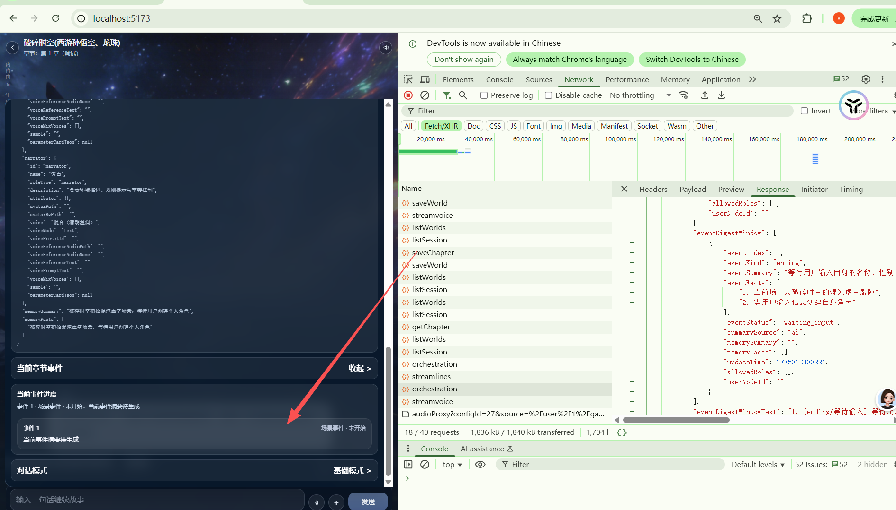

# no_modify
处理方案写在
md/plan/ai_game/V3/游玩业务/V3/resolve/testV2
# 编排师轻量化设计的效果
- 看看发送了什么
摘要:
| 区块 | 具体内容 | 估算 Tokens |
|---|---|---|
| **[世界]** | `名称: 破碎时空` `简介: <世界背景文本>` | ~100~200 |
| **[章节内部提纲]** | `标题: 第 1 章` `提纲摘录: <章节 directive 文本>` `用户交互节点: <userNode promptText>` `开场白: <章节 openingText>` | ~300~600 |
| **[角色列表]** | `- player \| 用户 \| <描述>` `- narrator \| 旁白 \| <描述>` `- npc \| 孙悟空 \| <描述>` `- npc \| 其他角色...`（每个角色带 describeRole() 输出） | ~200~500 |
| **[万能角色]** | 旁白兜底 / 或具体 NPC 名 | ~10~30 |
| **[剧情摘要]** | `背景摘要: <memorySummary>` `关键事实: <memoryFacts 最多5条>` | ~100~200 |
| **[当前阶段]** | `label: 阶段名` `goal: 阶段目标` `allowed_speakers: 旁白、孙悟...` | ~50~100 |
| **[当前事件]** | `index: 1` `kind: scene` `summary: <120字事件摘要>` `facts: <事件事实>` `memory_summary / memory_facts` `事件窗口: <近期对话片段>` | ~150~300 |
| **[回合状态]** | `can_player_speak: false` `expected_role_type: narrator` `expected_role: 旁白` `last_speaker: 无` | ~50~80 |
| **[最近对话]** | `旁白：混沌虚空开启...` `玩家：无`（最近 N 轮） | ~50~150 |
| **[用户本轮输入]** | `无`（首轮进入时为空） | ~2~5 |

具体:
[test.v2.detail.md](test.v2.detail.md)

优化项	节省 tokens	实施难度	推荐优先级
精简角色卡描述	600800/轮	低，改 describeRole()	⭐⭐⭐ 最高
切非推理模型	~1000/轮	低，改模型名	⭐⭐⭐ 最高
切换 compact 模式	200400/轮	低，改 flag	⭐ 低

- 我的设计
[3.0_bug_Resolve.md](../3.0_bug_Resolve.md)
编排师轻量化设计：
发送的内容砍为：
对话内容砍为10个台词+当前事件内容+事件序号+ 各个角色简洁的文字化动态参数卡
大模型返回:下个角色，角色动机，事件内容是否需要调整，调整结果。是否需要触发记忆管理

- ai对我设计的评价与出方案：
[3.0_bug_ai_resolve.md](../3.0_bug_ai_resolve.md)
- 最近 8~10 条对话
- 当前事件摘要
- 当前事件序号
- 当前事件的可说话角色
- 当前角色的文字化精简参数卡
- 当前故事的动态背景摘要

编排师返回：

- 下一个说话角色
- 角色动机
- 当前事件是否需要调整
- 调整后的事件摘要
- 是否触发记忆管理

- 我根据实际效果的评价
实际效果非常恶心！非常重。
ai 表面上是增加了：当前事件的可说话角色，当前故事的动态背景摘要。然而实际效果是一大堆东西

  - 解决方案。
  直接否定ai 的方案
  - 坚持我的设计:
  对话内容砍为10个台词+当前事件内容+事件序号+ 各个角色简洁的文字化动态参数卡
  特别说明一下“当前事件内容”本身就包含事件相关的角色信息。不需要额外发送一个"当前事件的可说话角色"
  大模型返回:下个角色，角色动机，事件内容是否需要调整，调整结果。是否需要触发记忆管理
  - 在发送内容里加强对角色卡的精简化。直发送关键的：
  角色名,性别,年龄,性格,等级.

  - 编排师的提示词问题：
  NarrativeOrchestrator.ts
  compactMode = shouldUseCompactOrchestratorPayload(promptAiConfig)
  - reasoning_tokens 问题
   豆包文本模型配置增加:reasoning_effort 参数。下拉框选择推理思考程度。默认minimal。

改为:
不再区分模型。改为直接使用 AI故事-剧情编排. 或者
AI故事-剧情编排(精简版)checkbox ,AI故事-剧情编排(高级版)checkbox
由用户自己设置用哪一个。

# 编排机制混乱，事件机制混乱
调试进去后没有按照要求生成章节事件，

[3.0_bug_Resolve.md](../3.0_bug_Resolve.md)
里面的要求是：
为当前章节生成静态事件。其他章节不管，动态事件数据只存在内存
结束条件成功，生成下个章节的静态事件。继续调试。
就算没有事件编排师也应该在编排时生成一个。而且结束条件本身就是个特殊事件！！

明显完全没有根据这个来实现。
同时再次质疑phase（阶段） 机制有个鸟用。这些限制到底是不是作茧自缚，狗屁不通！导致编排问题，章节结束条件判断机制失效？？？
phase（阶段） 机制 详细分析：
[test.V2.Phase.md](test.V2.Phase.md)
先看看第一章的问题所在。第一章最特别的地方是有开场白。
理论上是开场白-》第一章内容-》动态事件生成-》开始编排->
大模型返回:下个角色，角色动机，事件内容是否需要调整，调整结果。是否需要触发记忆管理

实际效果非常拉胯！开场白后，直接进入用户发言。
用户输入：1
直接进入了第二章
旁白：(战场各处还回荡着跨界混战的余波，西游悟空的金箍棒静静悬浮在虚空裂隙旁，那道青衫身影正不受时间影响地缓缓靠近)
唯有你能感知到这处异常，这是你唯一的干预机会。

(战场各处还回荡着跨界混战的余波，西游悟空的金箍棒静静悬浮在虚空裂隙旁，那道青衫身影正不受时间影响地缓缓靠近)
唯有你能感知到这处异常，这是你唯一的干预机会。

直接进入第二章的可能原因分析：
[test.V2.ending.md](test.V2.ending.md)

开场白直接进入用户发言的问题分析：
[test.V2.kaichang.md](test.V2.kaichang.md)

# 章节调试进入慢的分析
[test.V2.chapters_debug.md](test.V2.chapters_debug.md)

# 调试阶段进入编排后前端依然没有显示事件列表
[3.0_bug_Resolve.md](../3.0_bug_Resolve.md) 的“前端可观事件列表和进度”
故事设定下面增加一个当前章节的事件，点击展开当前章节事件列表和事件进度
展示当前事件的前五后四个事件也就是最多10个。
问题分析：
[test.V2.chapter_events.md](test.V2.chapter_events.md)