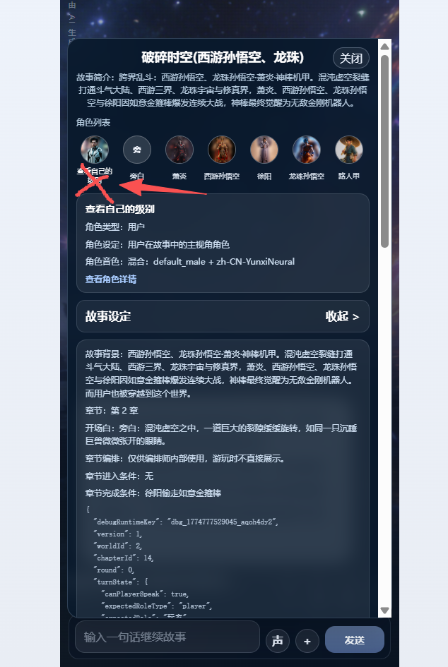
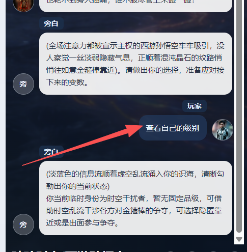

# 问题1 .用户在剧情里
旁白
(裂隙骤然爆发出刺目白光，你已然被卷入这片交错了诸界的破碎时空)
这里是跨界乱斗的战场，请告诉我你的姓名、性别与年龄，开启属于你的冒险吧。

异天，男，36
用户用户
旁
旁白
(你的身份信息已经记录完成，周身缠绕的混沌光影渐渐清晰)这里正是诸界错乱交融的破碎时空，此刻四方强者已经为争夺如意金箍棒展开混战，你的冒险正式开启。
这时候要更新用户的信息卡信息
 但是头像哪里要依然显示为用户，这是不能修改的！！！

# 问题2 信息卡内容不对
## 角色参数卡信息 -基础版
- 角色名
- 原始角色设定
- 性别
- 年龄
- 性格
- 外貌
- 音色特点
- 技能
- 物品
- 装备
- 血量
- 蓝量
- 金钱
- 其他(这个暂时显示为json 吧)

这些全都要。记住动态参数卡不改变头像下的角色名称！！！

# 问题3

输入了：查看自己的级别
正确是：旁白根据角色参数卡的级别继续回复
而不是角色的姓名变成了：查看自己的级别

# 问题4
编排师在编排时，
后端增加大模型返回增加：是否需要触发记忆管理agent （needOrganizeMem）
如果是，立马异步方式触记忆管理agent (无需等待记忆管理的反馈，编排师直接返回编排结果给前端)

记忆管理agent 在后台分析角色参数变化，游戏参数变化。