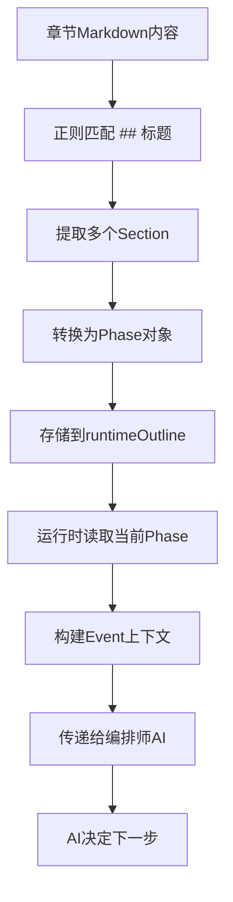

# 章节事件转换流程总结

## 一、核心概念

### 1.1 三个关键术语
- **Phase（阶段）**：章节内容的逻辑分段，对应Markdown中的`##`二级标题
- **Event（事件）**：运行时的事件概念，一个Phase对应一个Event
- **Section（段落）**：从章节内容解析出的原始文本块

### 1.2 数据流转关系
```
章节Markdown内容
  ↓ (正则匹配 ## 标题)
多个Section (heading + body)
  ↓ (转换函数)
多个Phase对象 (存储在 runtimeOutline)
  ↓ (运行时选择)
当前Phase (根据 progress.phaseId)
  ↓ (构建上下文)
当前Event (传递给编排师AI)
```

## 二、详细流程

### 2.1 章节内容格式示例

```markdown
## 全局状态（仅用户可见）
@系统：你已被卷入【混沌裂隙】
你当前身份：时空干扰者（临时）
你具备能力：感知异常、短暂干扰、标记目标

## 场景开始
@旁白：破碎的星辰残骸漂浮在虚空之中...
@西游孙悟空：此处虚空——俺老孙镇着。
@龙珠悟空：嘿！你很强啊！

## 🧩 用户行动1（被编排触发）
@系统（仅对用户）：你被冲击波掀飞，落在一块漂浮碎石上。
👉 请发言你的行动

## 主线推进
@旁白：战斗愈发激烈。
@萧炎：看来我来得正是时候。

## 🧩 用户行动2（异常感知）
@系统（仅对用户）：⚠️ 检测到异常
👉 请发言你的行动

## 高潮：时间停滞
@旁白：爆炸达到顶点——
```

### 2.2 代码层面的转换

#### 步骤1：解析Section
**文件**：`toonflow-game-app/src/lib/gameEngine.ts`
**函数**：`extractRuntimeSections()` (第310-327行)

```typescript
function extractRuntimeSections(input: unknown): Array<{ heading: string; body: string }> {
  const text = normalizeEditorText(input);
  const headingRegex = /^##\s*(.+)$/gm;  // 匹配二级标题
  const sections: Array<{ heading: string; body: string }> = [];
  const matches = Array.from(text.matchAll(headingRegex));
  
  for (let i = 0; i < matches.length; i += 1) {
    const current = matches[i];
    const next = matches[i + 1];
    const bodyStart = (current.index ?? 0) + current[0].length;
    const bodyEnd = next?.index ?? text.length;
    sections.push({
      heading: String(current[1] || "").trim(),  // "场景开始"
      body: text.slice(bodyStart, bodyEnd).trim(), // 内容文本
    });
  }
  return sections;
}
```

**输出示例**：
```javascript
[
  { heading: "全局状态（仅用户可见）", body: "@系统：你已被卷入【混沌裂隙】..." },
  { heading: "场景开始", body: "@旁白：破碎的星辰残骸..." },
  { heading: "🧩 用户行动1（被编排触发）", body: "@系统（仅对用户）：你被冲击波掀飞..." },
  ...
]
```

#### 步骤2：生成Phase对象
**函数**：`extractRuntimePhasesFromContent()` (第472-544行)

```typescript
function extractRuntimePhasesFromContent(
  input: unknown,
  userNodes: ChapterRuntimeUserNode[],
  fixedEvents: ChapterRuntimeOutline["fixedEvents"],
): ChapterRuntimePhase[] {
  const sections = extractRuntimeSections(input);
  const phaseDrafts: Array<ChapterRuntimePhase> = [];
  
  sections.forEach((section, index) => {
    const phaseId = `phase_${index + 1}_${slugifyRuntimeKey(section.heading)}`;
    const isUserPhase = isUserNodeHeading(section.heading); // 判断是否包含"用户行动"
    
    phaseDrafts.push({
      id: phaseId,                                  // "phase_2_场景开始"
      label: section.heading || `阶段 ${index + 1}`, // "场景开始"
      kind: isUserPhase ? "user" : "scene",         // 阶段类型
      targetSummary: normalizeRuntimeSummary(...),  // 阶段目标摘要
      userNodeId: userNode?.id || null,            // 用户节点ID
      allowedSpeakers: [...],                      // ["旁白", "孙悟空", "龙珠悟空"]
      nextPhaseIds: [],                            // 下一个阶段的候选ID
      defaultNextPhaseId: null,                    // 默认下一个阶段
      requiredEventIds: [],                        // 前置要求
      completionEventIds: [],                      // 完成触发事件
      advanceSignals: [],                          // 推进信号
      relatedFixedEventIds: [],                    // 关联固定事件
    });
  });
  
  return phaseDrafts;
}
```

**Phase类型判断**：
- `opening`: 开场阶段（章节开始）
- `scene`: 普通场景（NPC对话、旁白描述）
- `user`: 用户行动阶段（标题包含"用户行动"或emoji 🧩）
- `fixed`: 固定事件

#### 步骤3：存储到数据库
**表**：`t_game_chapter.runtimeOutline` (TEXT字段，JSON格式)

```json
{
  "openingMessages": [
    { "role": "旁白", "roleType": "narrator", "content": "..." }
  ],
  "phases": [
    {
      "id": "phase_1_全局状态",
      "label": "全局状态（仅用户可见）",
      "kind": "scene",
      "targetSummary": "告知用户当前身份和能力",
      "allowedSpeakers": ["系统"],
      ...
    },
    {
      "id": "phase_2_场景开始",
      "label": "场景开始",
      "kind": "scene",
      "targetSummary": "描述破碎星辰，引出孙悟空登场",
      "allowedSpeakers": ["旁白", "孙悟空", "龙珠悟空"],
      ...
    },
    {
      "id": "phase_3_用户行动1",
      "label": "🧩 用户行动1（被编排触发）",
      "kind": "user",
      "targetSummary": "引导用户选择行动",
      "allowedSpeakers": ["系统", "用户"],
      ...
    }
  ],
  "userNodes": [...],
  "fixedEvents": [...],
  "endingRules": {...}
}
```

### 2.3 运行时事件处理

#### 步骤4：读取当前Phase
**文件**：`toonflow-game-app/src/modules/game-runtime/engines/NarrativeOrchestrator.ts`
**函数**：`readCurrentRuntimeEventContext()` (第640-699行)

```typescript
function readCurrentRuntimeEventContext(chapter: any, state: JsonRecord) {
  const outline = normalizeChapterRuntimeOutline(chapter?.runtimeOutline);
  const progress = readChapterProgressState(state); // 从state读取进度
  const phases = Array.isArray(outline.phases) ? outline.phases : [];
  
  // 根据progress.phaseId找到当前Phase
  const currentPhase = progress.phaseId
    ? phases.find((item) => item.id === progress.phaseId) || null
    : phases[0] || null;
  
  // 判断事件流类型
  const eventFlowType = 
    currentPhase.kind === "opening" ? "introduction" :
    currentPhase.kind === "user" ? "chapter_content" :
    currentPhase.kind === "fixed" || currentPhase.kind === "ending" ? "chapter_ending_check" :
    "chapter_content";
  
  return {
    eventIndex: progress.eventIndex,        // 第几个事件（从1开始）
    eventKind: currentPhase.kind,           // "scene" | "user" | "opening" | "fixed"
    eventFlowType: eventFlowType,           // "introduction" | "chapter_content" | "chapter_ending_check"
    eventSummary: currentPhase.targetSummary,
    eventFacts: [...],
    eventStatus: progress.eventStatus,      // "active" | "waiting_input" | "completed"
    // ...
  };
}
```

#### 步骤5：传递给编排师
**函数**：`runNarrativePlan()` (第2240-2285行)

```typescript
export async function runNarrativePlan(input: {
  userId: number;
  world: any;
  chapter: any;
  state: JsonRecord;
  recentMessages: any[];
  playerMessage: string;
}): Promise<OrchestrationPlan> {
  
  const currentPhase = readCurrentChapterPhase(input.chapter, input.state);
  const currentEvent = readCurrentRuntimeEventContext(input.chapter, input.state);
  
  const payload = {
    worldName: input.world?.name,
    chapterTitle: input.chapter?.title,
    chapterDirective: input.chapter?.content,
    
    // 当前阶段信息
    currentPhaseLabel: currentPhase?.label,           // "场景开始"
    currentPhaseGoal: currentPhase?.targetSummary,    // 阶段目标
    
    // 当前事件信息
    currentEventIndex: currentEvent.eventIndex,       // 2
    currentEventKind: currentEvent.eventKind,         // "scene"
    currentEventFlowType: currentEvent.eventFlowType, // "chapter_content"
    currentEventStatus: currentEvent.eventStatus,     // "active"
    currentEventSummary: currentEvent.eventSummary,   // "描述破碎星辰..."
    currentEventFacts: currentEvent.eventFacts,       // ["金箍棒插入混沌晶石", ...]
    
    // 阶段约束
    phaseAllowedSpeakers: currentPhase?.allowedSpeakers, // ["旁白", "孙悟空", "龙珠悟空"]
    
    // 上下文信息
    roles: [...],                  // 所有角色
    recentDialogue: [...],         // 最近对话
    latestPlayerMessage: "...",    // 用户最新输入
    turnState: {...},              // 轮次状态
  };
  
  // 调用编排师AI
  const aiResult = await u.ai.text.invoke({
    usageType: "编排师",
    systemPrompt: buildOrchestratorSystemPrompt(payload),
    userPrompt: buildOrchestratorUserPrompt(payload),
  });
  
  return parseOrchestratorResult(aiResult);
}
```

### 2.4 Phase流转机制

**文件**：`toonflow-game-app/src/modules/game-runtime/engines/ChapterProgressEngine.ts`

#### 核心函数：`resolveCurrentOrNextPhase()` (第200-220行)

```typescript
function resolveCurrentOrNextPhase(
  outline: ChapterRuntimeOutline,
  currentPhaseId: string,
  completedEvents: string[],
): { phase: ChapterRuntimePhase | null; phaseIndex: number } {
  
  // 1. 如果当前Phase未完成，继续当前Phase
  if (currentPhaseId) {
    const matchedIndex = outline.phases.findIndex((item) => item.id === currentPhaseId);
    if (matchedIndex >= 0 && !isPhaseCompleted(completedEvents, currentPhaseId)) {
      return {
        phase: outline.phases[matchedIndex],
        phaseIndex: matchedIndex,
      };
    }
  }
  
  // 2. 从前往后找到第一个"未完成且满足前置条件"的Phase
  for (let index = 0; index < outline.phases.length; index += 1) {
    const phase = outline.phases[index];
    
    // 跳过已完成的Phase
    if (isPhaseCompleted(completedEvents, phase.id)) {
      continue;
    }
    
    // 检查前置条件是否满足
    if (!arePhaseRequirementsMet(completedEvents, phase)) {
      continue;
    }
    
    // 返回第一个可执行的Phase
    return { phase, phaseIndex: index };
  }
  
  // 3. 所有Phase都已完成，返回null
  return { phase: null, phaseIndex: outline.phases.length };
}
```

#### Phase完成标记
**函数**：`markPhaseCompleted()` (第162-165行)

```typescript
function isPhaseCompleted(completedEvents: string[], phaseId: string | null): boolean {
  if (!phaseId) return false;
  return completedEvents.map((item) => String(item || "").trim()).includes(`phase:${phaseId}`);
}
```

**存储位置**：`state.completedEvents` 数组

```json
{
  "completedEvents": [
    "phase:phase_1_全局状态",
    "phase:phase_2_场景开始",
    "phase:phase_3_用户行动1"
  ]
}
```

## 三、AI提示词示例

编排师AI收到的实际提示词（简化版）：

```
【世界】混沌裂隙
【章节】第1章 - 混沌裂隙初遇

【章节目标】
引导用户体验时空裂隙，与孙悟空、龙珠悟空、萧炎相遇

【当前阶段】
阶段名称：场景开始
阶段目标：描述破碎星辰，引出孙悟空登场

【当前事件】
事件索引：2
事件类型：scene
事件流类型：chapter_content
事件状态：active
事件摘要：孙悟空与龙珠悟空初次相遇，展开战斗
事件事实：
- 金箍棒插入混沌晶石
- 两股力量碰撞
- 空间震裂

【允许发言者】
旁白、孙悟空、龙珠悟空

【最近对话】
[旁白]: 破碎的星辰残骸漂浮在虚空之中...
[孙悟空]: 此处虚空——俺老孙镇着。
[龙珠悟空]: 嘿！你很强啊！

【用户最新输入】
（无）

【角色列表】
- 旁白 (narrator): 负责环境推进、规则提示与节奏控制
- 孙悟空 (npc): 西游孙悟空，拥有金箍棒
- 龙珠悟空 (npc): 龙珠悟空，战斗力极强
- 用户 (player): 时空干扰者

【请决定】
1. 下一轮由谁发言？(speaker)
2. 发言动机是什么？(motive)
3. 是否轮到用户？(awaitUser)
4. 下一个角色是谁？(nextSpeaker)
```

## 四、关键架构设计

### 4.1 为什么不让编排师看到完整章节？

**原因**：
1. **Token限制**：完整章节内容可能数千字，超出AI上下文窗口
2. **聚焦当前**：编排师只需关注当前阶段，避免被其他阶段干扰
3. **控制成本**：减少不必要的Token消耗
4. **提高质量**：聚焦当前上下文，决策更精准

### 4.2 如何保证剧情连贯性？

**机制**：
1. **Phase依赖关系**：通过`requiredEventIds`确保前置条件
2. **事件摘要传递**：每次AI决策后更新`eventSummary`和`eventFacts`
3. **事件窗口**：`currentEventWindow`提供最近3-5个事件的摘要
4. **记忆系统**：`memorySummary`和`memoryFacts`存储长期记忆

### 4.3 Phase与Trigger的关系

**区别**：
- **Phase**：章节内容的静态分段，由`##`标题定义，属于章节设计层面
- **Trigger**：运行时的动态触发器，由数据库`t_chapterTrigger`定义，属于规则系统

**联系**：
- Trigger可以在特定Phase触发（通过`conditionExpr`判断`state.phaseId`）
- Phase完成可以触发特定事件（通过`completionEventIds`）

## 五、Mermaid流程图

### 5.1 简化流程图
文件位置：`Toonflow-game-doc/orchestration-simple.mmd`



### 5.2 详细流程图
文件位置：`Toonflow-game-doc/orchestration-detail.mmd`

详细展示了：
- 入口参数处理
- 正式模式 vs 调试模式
- AI编排引擎内部流程
- 持久化机制
- 返回结果结构

### 5.3 思维导图
文件位置：`Toonflow-game-doc/orchestration-flow.mmd`

以思维导图形式展示了完整的API调用流程。

## 六、总结

### 核心要点
1. **一个Phase = 一个Event**：章节通过`##`标题划分为多个Phase，运行时每个Phase对应一个Event
2. **Phase类型**：`opening`/`scene`/`user`/`fixed`，决定了事件的流类型
3. **编排师看到的**：不是完整章节，而是当前Phase的摘要、目标、允许发言者、最近对话
4. **流转机制**：通过`completedEvents`数组跟踪已完成的Phase，自动推进到下一个Phase

### 优化建议
基于对事件机制的理解，可以优化编排师与章节判定的合并：
- 编排师提示词中已包含`eventFlowType`（可识别是否在`chapter_ending_check`）
- 可以在编排师提示词中增加章节判定逻辑，输出`chapterOutcome`字段
- 避免二次AI调用，直接在编排师中完成章节判定
